# Mod Systems vs Game Systems: Update Phase Mapping

> **Purpose**: Documents which update phase each WE system uses, how those phases map to the game's frame lifecycle, and where timing mismatches or improvement opportunities exist.

## Game Update Phase Execution Order (per frame)

The game processes phases sequentially within a single frame:

```
MainLoop → LateUpdate → Modification1 → Modification2 → Modification2B →
Modification3 → Modification4 → Modification4B → Modification5 → ModificationEnd →
PreSimulation → PostSimulation → GameSimulation → EditorSimulation →
Rendering → PreTool → PostTool → ToolUpdate → ClearTool → ApplyTool →
Serialize → Deserialize → UIUpdate → UITooltip → PrefabUpdate →
DebugGizmos → LoadSimulation → PreCulling → CompleteRendering →
Raycast → PrefabReferences → Cleanup
```

Each phase call is blocking: all systems in phase N complete before phase N+1 starts.

## WE System Phase Assignment

| System | Phase | Registration Method | Base Class |
|--------|-------|---------------------|------------|
| `WENodeExtraDataUpdater` | Modification1 | `AllowedPhase.Modification1` | `BelzontBasicSystem` |
| `WENodeExtraDataUpdater2B` | Modification2B | `AllowedPhase.Modification2B` | `BelzontBasicSystem` |
| `WEWorldPickerController` | ModificationEnd | `UpdateAt` | `ComponentSystemBase` |
| `FontServer` | Rendering | `UpdateAt` | `GameSystemBase` |
| `WEAtlasesLibrary` | Rendering | `UpdateAt` | — |
| `WECustomMeshLibrary` | Rendering | `UpdateAt` | — |
| `WETemplateManager` | Rendering | `UpdateAfter` | `SystemBase` |
| `WETemplateUpdateSystem` | Rendering | `UpdateAfter` | `SystemBase` |
| `WETemplateQuerySystem` | Rendering | `UpdateAfter` | `SystemBase` |
| `WEPrefabLayoutSystem` | Rendering | `UpdateAfter` | `SystemBase` |
| `WETemplateDisposalSystem` | Rendering | `UpdateAfter` | `GameSystemBase` |
| `WEPreCullingSystem` | PreCulling | `UpdateAt` | `SystemBase` |
| `WERendererSystem` | MainLoop (EndFrame) | Unity callback | `BelzontBasicSystem` |
| `WEPostRendererSystem` | MainLoop (EndFrame) | `AllowedPhase.EndFrame` | `BelzontBasicSystem` |
| `WEEmissiveLightSystem` | MainLoop (EndFrame) | `AllowedPhase.EndFrame` | `BelzontBasicSystem` |
| `WEUISystem` | UIUpdate | `UpdateAt` | — |
| `WEMainUISystem` | UIUpdate | `UpdateAt` | `UISystemBase` |
| `WELayoutController` | UIUpdate | `UpdateAt` | — |
| `WEWorldPickerTooltip` | UITooltip | `UpdateAfter` | — |

## Phase Timeline Diagram

```mermaid
gantt
    title WE Systems in Game Frame Timeline
    dateFormat X
    axisFormat %s

    section Modification
    WENodeExtraDataUpdater (Mod1)     :m1, 0, 1
    WENodeExtraDataUpdater2B (Mod2B)  :m2b, 1, 2
    WEWorldPickerController (ModEnd)  :mend, 2, 3

    section Rendering
    FontServer                        :r1, 3, 4
    WEAtlasesLibrary                  :r2, 3, 4
    WECustomMeshLibrary               :r3, 3, 4
    WETemplateManager                 :r4, 4, 5
    WETemplateUpdateSystem            :r5, 5, 6
    WETemplateQuerySystem             :r6, 6, 7
    WEPrefabLayoutSystem              :r7, 7, 8
    WETemplateDisposalSystem          :r8, 8, 9

    section UIUpdate
    WEUISystem                        :u1, 9, 10
    WEMainUISystem                    :u2, 9, 10
    WELayoutController                :u3, 9, 10

    section UITooltip
    WEWorldPickerTooltip              :tt, 10, 11

    section PreCulling
    WEPreCullingSystem                :pc, 11, 12

    section Unity Render Callback
    WERendererSystem (Graphics.DrawMesh) :rr, 13, 14
    WEPostRendererSystem              :rp, 13, 14
    WEEmissiveLightSystem             :re, 13, 14
```



## Key Observations

### 1. Rendering Phase Is Heavily Loaded
Eight WE systems run during the Rendering phase. The game's own rendering systems also run here (BatchUploadSystem, ObjectMeshSystem, etc.). This creates competition for CPU time within a single phase.

### 2. EndFrame Systems Run Outside Normal Phase Ordering
`WERendererSystem`, `WEPostRendererSystem`, and `WEEmissiveLightSystem` use `AllowedPhase.EndFrame` which maps to `SystemUpdatePhase.MainLoop`. However, `WERendererSystem` actually hooks into `RenderPipelineManager.beginContextRendering` — a Unity callback that fires when the GPU is ready to render. This means it runs **outside** the normal ECS update loop, potentially at a different time than the other EndFrame systems.

### 3. PreCulling Phase Alignment
`WEPreCullingSystem` correctly runs in the PreCulling phase alongside the game's `PreCullingSystem`. This phase occurs **after** UITooltip and **before** CompleteRendering, which means:
- Culling data is fresh when rendering starts
- WE culling integrates with game culling via `GetCullingData()`

### 4. Node Updaters in Modification Phases
`WENodeExtraDataUpdater` (Modification1) and `WENodeExtraDataUpdater2B` (Modification2B) run early in the frame. This is appropriate because they process edge/node topology changes that may have occurred from simulation. The data they produce is consumed much later in the frame during PreCulling and Rendering.

## Comparison: Game System Phase Usage

The game distributes its rendering-related systems as:

| Game System | Phase |
|-------------|-------|
| `CameraUpdateSystem` | Rendering |
| `RenderingSystem` | Rendering |
| `PreCullingSystem` | PreCulling |
| `BatchUploadSystem` | Rendering |
| `CompleteRenderingSystem` | CompleteRendering |

The game keeps rendering logic minimal — camera and LOD setup in Rendering, visibility in PreCulling, GPU upload in CompleteRendering. WE concentrates template management, font processing, atlas management, and formula evaluation all in the Rendering phase alongside actual render setup.
