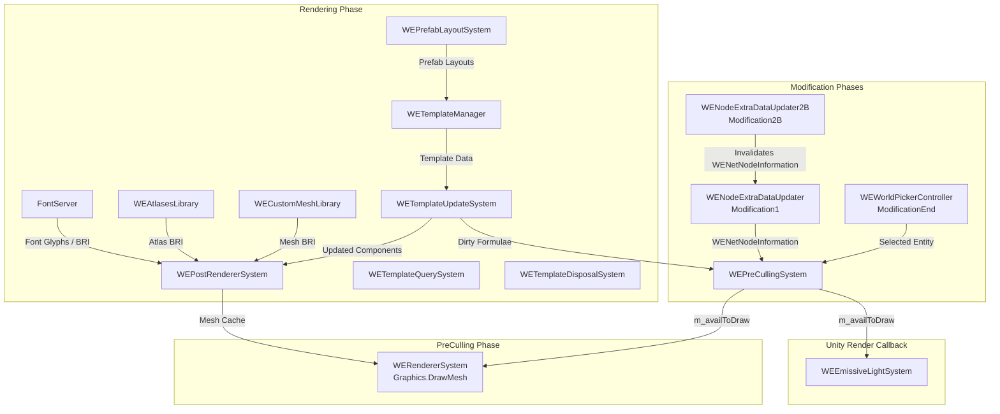

# Mod Systems vs Game Systems: Timing Improvement Analysis

> **Purpose**: Evaluates whether the current update phase assignments can be improved for performance or correctness, analyzes data dependencies, and provides concrete recommendations.

## Data Dependency Chain

Understanding which systems produce data consumed by other systems is critical before proposing phase changes.

## Analysis Per System

### A. Systems That Are Correctly Placed

#### 1. WENodeExtraDataUpdater (Modification1) — CORRECT
- **Rationale**: Processes `Node` + `ConnectedEdge` topology. Modification phases are intended for reacting to entity creation/deletion/modification from the simulation step. Running in Modification1 ensures node cache is ready before any downstream system needs it.
- **Data Consumers**: `WERoadFn` built-in functions (consumed during formula evaluation in Rendering phase).
- **Verdict**: No change needed.

#### 2. WENodeExtraDataUpdater2B (Modification2B) — CORRECT
- **Rationale**: Invalidates node caches when edges are deleted/aggregated. Must run after Modification2 (where edge aggregation happens in the game) but before ModificationEnd.
- **Verdict**: No change needed.

#### 3. WEPreCullingSystem (PreCulling) — CORRECT
- **Rationale**: Consumes game's `PreCullingData` from `PreCullingSystem.GetCullingData()`. Must run in PreCulling phase to access fresh visibility data. Produces `m_availToDraw` for the renderer.
- **Optimization Note**: The system correctly uses `IJobParallelFor` for culling work and maintains frame-to-frame caching via `m_geomEntitiesLastFrame` to skip unchanged entities.
- **Verdict**: No change needed.

#### 4. WEWorldPickerController (ModificationEnd) — CORRECT
- **Rationale**: Handles entity commands (add/remove/reparent) which are structural ECS changes. ModificationEnd is the designated phase for final structural modifications before simulation.
- **Verdict**: No change needed.

### B. Systems That Could Potentially Be Relocated

#### 1. FontServer (Rendering → PreCulling or separate dedicated phase)

**Current**: Runs in Rendering phase. Processes font glyph rendering jobs, manages atlas textures, and produces `IBasicRenderInformation` meshes.

**Observation**: FontServer's work is a **producer** for `WEPostRendererSystem`. The `StringRenderingJob` (which generates mesh data from text) could be scheduled earlier in the frame and completed later, spreading CPU work across more of the frame.

**However**: FontServer uses `Texture2D.Apply()` every 60 frames for GPU upload of atlas data. This operation must happen on the main thread. Additionally, the cache completion (`Dependency.Complete()`) at end of `RunJobs()` forces synchronization.

**Verdict**: ⚠️ **Minor improvement possible**. The font glyph rasterization (scheduling of `StringRenderingJob`) could be kicked off earlier (e.g., in a modification phase or PreSimulation), with results read back in Rendering. This would allow the jobs to overlap with simulation work. However, the practical impact depends on how many new strings need rendering per frame — in steady state, most strings are cached, making this a marginal gain.

#### 2. WETemplateQuerySystem (Rendering → UIUpdate)

**Current**: Runs in Rendering phase with `[UpdateAfter(WETemplateUpdateSystem)]`.

**Observation**: `WETemplateQuerySystem` provides UI query methods (`GetCityTemplateUsageCount`, `CanBePrefabLayout`). It doesn't produce data consumed by the rendering pipeline. It's only called from UI code.

**Verdict**: ✅ **Can be moved to UIUpdate phase**. This would reduce the number of systems competing in the Rendering phase. The system's `OnUpdate()` is minimal (completes dependency only), so the cost saved is small, but it correctly reflects the system's purpose.

#### 3. WETemplateDisposalSystem (Rendering → Cleanup or ModificationEnd)

**Current**: Runs in Rendering phase. Runs every 256 frames. Destroys orphaned entities and components.

**Observation**: Entity disposal is a structural ECS operation. The game's own cleanup/disposal systems typically run in the Cleanup phase (end of frame). Running cleanup during Rendering phase can cause structural changes that invalidate entity queries mid-frame for other Rendering-phase systems.

**Verdict**: ⚠️ **Should be evaluated for Cleanup phase**. Moving to Cleanup would be more idiomatic. However, this depends on whether the disposal must happen before template processing in the next frame (which Cleanup → Modification1 would satisfy). If the system uses `EntityCommandBuffer` properly (deferred execution), the actual structural changes already happen at the barrier anyway, making the point moot for correctness — but it would still free CPU time during Rendering.

### C. Systems With No Phase Concern

#### 1. WERendererSystem (Unity Callback) — NOT MOVABLE
Hooks into `RenderPipelineManager.beginContextRendering`. This is invoked by the Unity rendering pipeline, not by the ECS update loop. Cannot be relocated.

#### 2. WEPostRendererSystem (EndFrame/MainLoop) — QUESTIONABLE PLACEMENT
**Current**: Uses `AllowedPhase.EndFrame` → `SystemUpdatePhase.MainLoop`. This means it runs at the start of the **next** frame's MainLoop phase, not at the end of the current frame.

**Observation**: This system prepares mesh cache (`IBasicRenderInformation`) by processing entities with `WEWaitingRendering`. Its output is consumed in the same frame by `WERendererSystem` (via the Unity callback). If MainLoop runs **before** the Unity render callback, the timing is correct. If not, there's a one-frame latency.

**Verdict**: ⚠️ **Needs verification**. The Unity `beginContextRendering` callback fires after all ECS phases complete for the frame, so MainLoop (beginning of ECS frame) → ... → all phases → Unity render callback should work. But this introduces a full frame-width dependency gap. Moving this to `Rendering` phase (after template systems) or `PreCulling` could reduce latency.

#### 3. WEEmissiveLightSystem (EndFrame/MainLoop) — ACCEPTABLE
Reads `m_availToDraw` from `WEPreCullingSystem` and manages GameObjects. Since it modifies GameObjects (not ECS), it has no phase constraint from ECS perspective. MainLoop is acceptable.

## Summary of Recommendations

| ID| System | Current Phase | Recommended Phase | Impact | Risk |
|---|--------|--------------|-------------------|--------|------|
| 1 | `WETemplateQuerySystem` | Rendering | UIUpdate | Low (frees Rendering slot) | Low |
| 2 | `WETemplateDisposalSystem` | Rendering | Cleanup | Low (more idiomatic) | Low |
| 3 | `FontServer` job scheduling | Rendering | PreSimulation (kick) + Rendering (read) | Medium (overlaps sim) | Medium |
| 4 | `WEPostRendererSystem` | MainLoop | Rendering (after templates) | Medium (reduces latency) | Medium |
| 5 | All others | As-is | No change | — | — |

## Conclusion

The current phase assignments are largely correct and follow logical data dependency ordering. The heaviest opportunity is **spreading font rendering jobs** across a wider portion of the frame to overlap with simulation work — but this only matters when many new strings need rendering (not in steady state).

The most immediately actionable and low-risk changes are moving `WETemplateQuerySystem` to UIUpdate and `WETemplateDisposalSystem` to Cleanup, which reduce Rendering-phase congestion without affecting correctness.

The mod correctly mirrors the game's own pattern of using PreCulling for visibility determination and Rendering for data preparation. The use of `beginContextRendering` for actual draw calls is consistent with how game overlay systems work.
