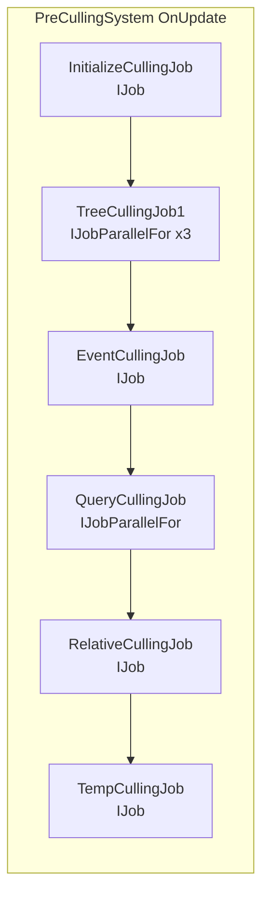
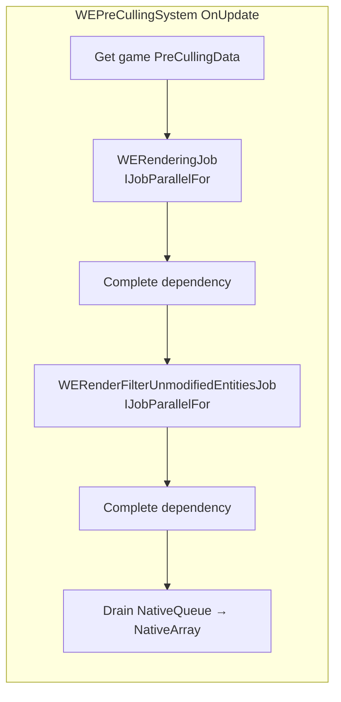
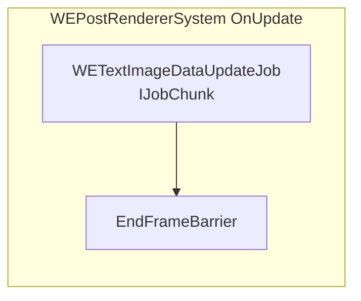
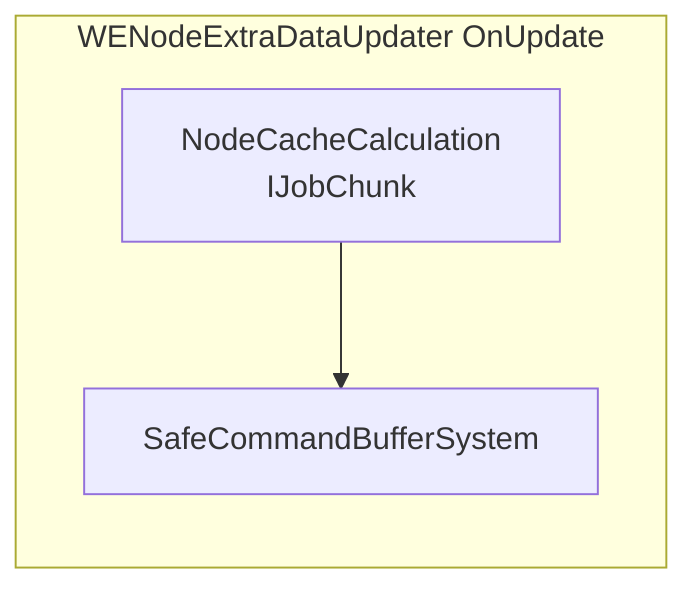
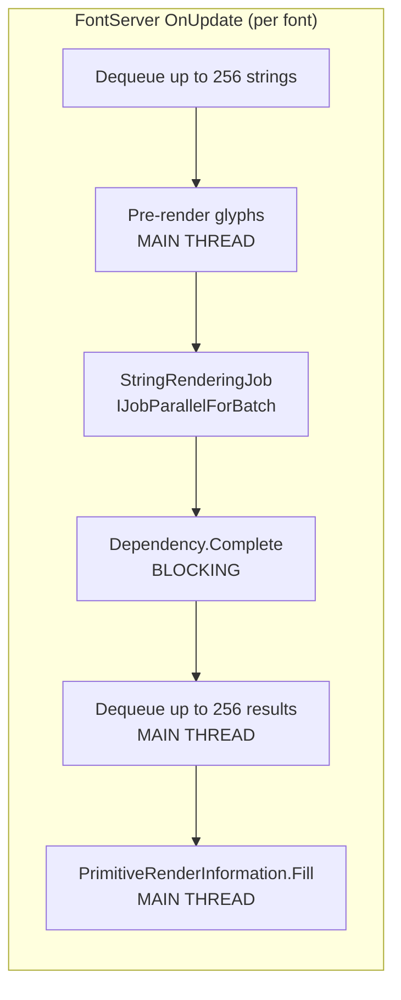

# Mod Systems vs Game Systems: Job Scheduling Patterns

> **Purpose**: Compares how the mod schedules jobs vs how the game's own systems schedule jobs, identifying patterns that could improve throughput.

## Game Job Scheduling Patterns

### PreCullingSystem (Game)
The game's culling system demonstrates best-practice multi-job scheduling:



Key characteristics:
- Multiple job types chained with explicit dependencies
- `IJobParallelFor` used for tree traversal (high entity count)
- `IJob` used for smaller sequential operations
- Output written to `NativeList<PreCullingData>` for downstream consumption
- Readers/writers tracked via `AddCullingDataReader()/AddCullingDataWriter()`

### BatchUploadSystem (Game)
- Uses `IJobParallelFor` per batch group
- Schedules N parallel upload jobs at once
- Completion deferred until `CompleteRenderingSystem`

### GameSystemBase Update Interval Pattern
```csharp
virtual int GetUpdateInterval(SystemUpdatePhase phase) → power-of-2 (1, 2, 4, 8...)
virtual int GetUpdateOffset(SystemUpdatePhase phase) → frame offset

// UpdateSystem checks: if ((updateIndex & (interval - 1)) == offset) → run
```

This allows systems to skip frames efficiently using bitmask checks.

## WE Mod Job Scheduling Patterns

### WEPreCullingSystem


**Pattern comparison**:
- Uses `IJobParallelFor` like the game — ✅ good
- Two separate `Complete()` calls — forces synchronization mid-update
- Queue→Array drain is on the main thread — potential bottleneck

### WEPostRendererSystem


**Pattern comparison**:
- Uses `IJobChunk` — ✅ correct for component-level iteration
- Defers structural changes via `EntityCommandBuffer.ParallelWriter` — ✅ matches game pattern
- Accesses `FontServer.Instance.DictPtr` via `GCHandle` — necessary for managed reference access from jobs

### WENodeExtraDataUpdater


**Pattern comparison**:
- Single job, deferred commands — ✅ clean
- Uses `EntityCommandBuffer.ParallelWriter` — ✅ thread-safe

### FontServer


**Pattern comparison**:
- ⚠️ **Synchronous completion** (`Dependency.Complete()`) blocks the main thread
- ⚠️ **Main-thread glyph rasterization** before job scheduling
- ⚠️ **Main-thread result consumption** after job completion
- ⚠️ **Per-font loop** — if N fonts are loaded, this runs N times sequentially
- ✅ Uses `IJobParallelForBatch` for string mesh generation — good parallelism within each font

## Comparison Table

| Aspect | Game Systems | WE Mod Systems |
|--------|-------------|----------------|
| Multi-job chaining | Chains 5+ jobs with explicit deps | Usually 1-2 jobs per system |
| Deferred completion | Schedules in one phase, completes in another | Often completes in-place (`Dependency.Complete()`) |
| ECB usage | Consistent `EntityCommandBuffer.ParallelWriter` | Same — ✅ matches |
| Update intervals | Power-of-2 via `GetUpdateInterval()` | Manual frame counting (`(FrameCounter + Index) & 0x1f`) |
| Main-thread work | Minimal — setup + scheduling | More — glyph raster, cache management |
| Barrier systems | `EndFrameBarrier` etc. | `SafeCommandBufferSystem` (equivalent) |

## Improvement Opportunities

### 1. Deferred Job Completion for FontServer
**Current**: `Dependency.Complete()` blocks after each font's `StringRenderingJob`.
**Improvement**: Schedule all font jobs in one pass, collect handles, complete them all at once (or defer to a later phase).

```
// Current (blocks per font):
foreach (font in fonts) {
    font.ScheduleJobs();
    font.Dependency.Complete();  // BLOCKS
    font.PostProcess();          // BLOCKS
}

// Improved (batch scheduling):
var handles = new NativeList<JobHandle>();
foreach (font in fonts) {
    handles.Add(font.ScheduleJobs());
}
JobHandle.CompleteAll(handles);
foreach (font in fonts) {
    font.PostProcess();
}
```

**Impact**: Allows StringRenderingJobs for multiple fonts to run in parallel across worker threads.

### 2. Frame-Based Update Interval Using GameSystemBase Pattern
**Current**: Manual bitmask check in renderer: `(FrameCounter + entity.Index) & 0x1f == 0`
**Improvement**: Use `GetUpdateInterval()` override for systems that don't need every-frame updates.

The `WETemplateDisposalSystem` already does this (runs every 256 frames). Other systems could benefit:
- `WETemplateQuerySystem` — only needed when UI is open
- `WEEmissiveLightSystem` — lights don't need per-frame updates if entity hasn't moved

### 3. WEPreCullingSystem Double-Complete
**Current**: Two `Complete()` calls within `OnUpdate()`.
**Observation**: The second job (`WERenderFilterUnmodifiedEntitiesJob`) depends on the first job's output. This is unavoidable if the filter job reads what the culling job wrote. However, the Queue→Array drain after the second Complete could be replaced with a job.

**Alternative**: Use a single job that both culls new entities AND re-adds unmodified ones, outputting directly to a `NativeArray` instead of a `NativeQueue`. This removes one synchronization point and the main-thread drain.

### 4. Pre-Culling Data Access Pattern
The mod accesses game culling data via:
```csharp
data = m_preCullingSystem.GetCullingData(true, out JobHandle deps);
```

This is the read-only path (`true` = readOnly), which is correct and allows other readers to proceed in parallel. No improvement needed here.

## Conclusion

The mod's job scheduling is functional but more synchronous than the game's patterns. The biggest practical improvement is **batching FontServer job completion** across all fonts rather than completing per-font. The double-complete in PreCulling is a structural issue worth addressing if entity counts grow large. Other systems already follow good patterns with `IJobChunk` + `EntityCommandBuffer.ParallelWriter`.
