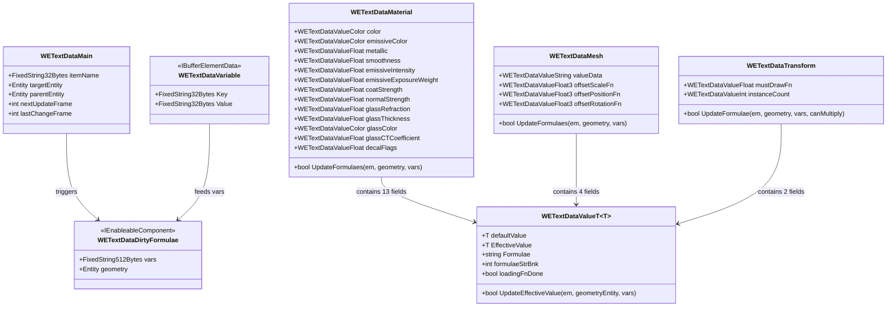
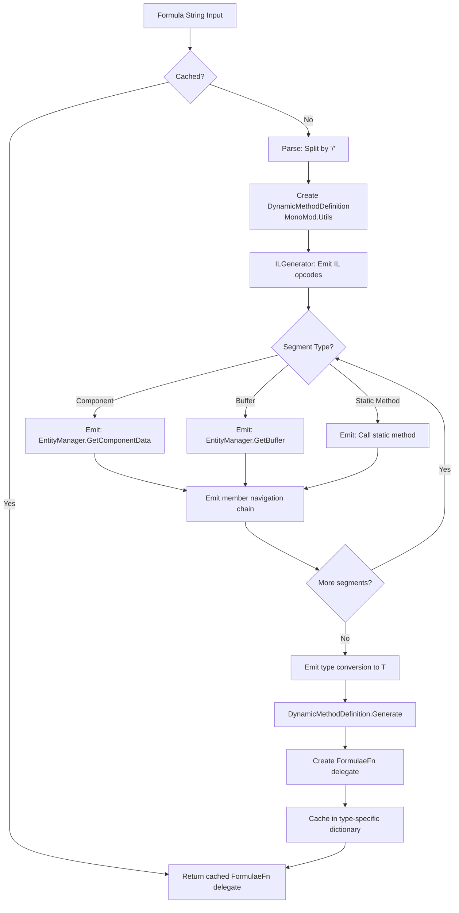
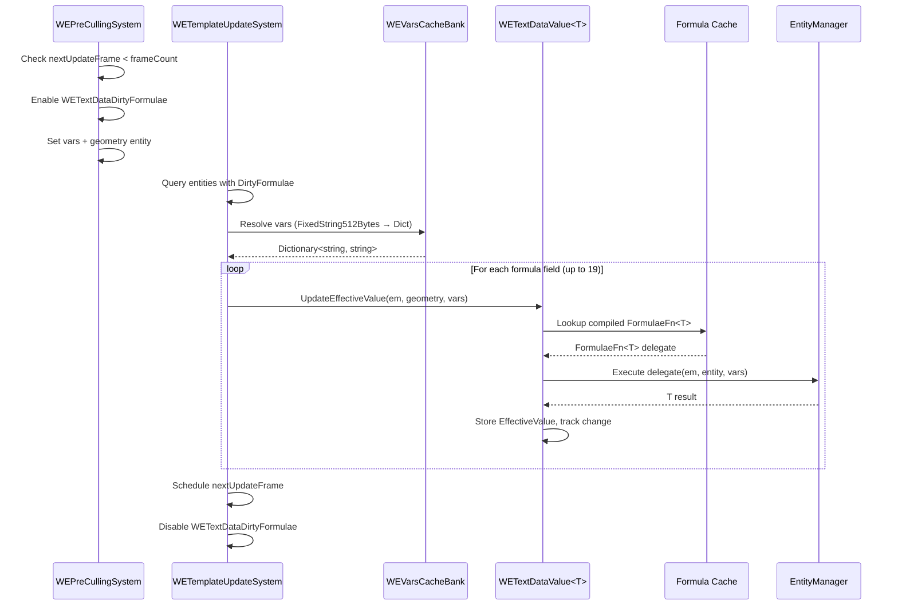

# Formulae System: Architecture & Data Flow

> **Purpose**: Documents the complete formulae system architecture, from formula string input to runtime evaluation output, including all data structures and the IL compilation pipeline.

## System Overview

The WE formulae system allows text properties (color, position, scale, visibility, text content) to be driven by dynamic expressions that read ECS component data at runtime. Formulas are compiled to IL (Intermediate Language) at first use and cached as delegates for subsequent evaluations.

## Data Structure Hierarchy



## Value Wrapper Types

All formulae-driven properties use the `WETextDataValue<T>` pattern:

| Type | Error Value | Thread Safety | Usage Count |
|------|-------------|---------------|-------------|
| `WETextDataValueFloat` | `float.NaN` | Thread-locked | ~7 fields in Material, 1 in Transform |
| `WETextDataValueInt` | `int.MinValue` | Frame-wise ECS | 1 field in Transform |
| `WETextDataValueFloat3` | `(NaN, NaN, NaN)` | Frame-wise ECS | 3 fields in Mesh |
| `WETextDataValueColor` | `Color.magenta` | Frame-wise ECS | 3 fields in Material |
| `WETextDataValueString` | `"<ERROR>"` | Frame-wise ECS | 1 field in Mesh |

Total per entity: up to **19 formula-capable fields**.

## Formula String Format

### Structure
```
segment1/segment2/segment3
```
Each segment separated by `/` represents one step in a navigation chain.

### Segment Types

| Prefix | Meaning | Example |
|--------|---------|---------|
| (none) | Component navigation | `Transform;m_Position.x` |
| `&` | Static method call | `&WEBuildingFn;GetBuildingRoad.m_Name` |

### Member Navigation Operators

| Operator | Meaning | Example |
|----------|---------|---------|
| `.fieldName` | Field/property access | `.m_Position` |
| `.N` (integer) | Array index | `.3` (element at index 3) |
| `.+N` | Add | `.+5.5` |
| `.-N` | Subtract | `.-10` |
| `.*N` | Multiply | `.*2.5` |
| `.÷N` | Divide | `.÷4` |
| `.%` | Modulus | `.%360` |
| `.=` | Equality (→ int) | `.=1` |
| `.>` | Greater than (→ int) | `.>0` |
| `.<` | Less than (→ int) | `.<100` |
| `.∧` | Bitwise AND | `.∧0xFF` |
| `.∨` | Bitwise OR | `.∨0x01` |
| `.⊕` | Bitwise XOR | `.⊕0xFF` |
| `.¬` | Bitwise NOT | `.¬` |

### Example Formulas

```
// Get building's road number
&WEBuildingFn;GetBuildingRoadNumber

// Get transform X position, add 5
Transform;m_Position.x.+5

// Conditional: 1 if night, 0 if day
&WEEffectsFn;GetNightLight01

// Get vehicle license plate line 1
&WEVehicleFn;GetVehiclePlateLine1

// Get nth waypoint name using variable
&WERouteFn;GetNthWaypoint/&WEUtitlitiesFn;GetEntityName
```

## Compilation Pipeline



### Generated IL Signature
```csharp
T __WE_CS2_{TypeName}_formulae_{sanitized}(
    EntityManager em, 
    Entity e, 
    Dictionary<string, string> vars
)
```

### Cache Storage (6 dictionaries, one per return type)
- `cachedFnsString[formulaString] → BaseCache<string>`
- `cachedFnsFloat[formulaString] → BaseCache<float>`
- `cachedFnsInt[formulaString] → BaseCache<int>`
- `cachedFnsFloat3[formulaString] → BaseCache<float3>`
- `cachedFnsColor[formulaString] → BaseCache<Color>`
- `cachedFnsEntityArray[formulaString] → BaseCache<IList<Entity>>`

## Runtime Evaluation Flow



## Variable System

Variables are stored per-entity as `DynamicBuffer<WETextDataVariable>` and serialized into a compact string format for cross-system transport:

### Serialization Format
```
key1→value1↓key2→value2↓key3→value3
```
- `↓` = item separator
- `→` = key-value separator

### Caching via WEVarsCacheBank
```
FixedString512Bytes (serialized) → int (index) → Dictionary<string,string> (parsed)
```
The bank deduplicates identical variable sets. Entities sharing the same variables point to the same cached dictionary.

### Special Variable Keys

| Key Pattern | Purpose | Consumer |
|-------------|---------|----------|
| `!!r1` through `!!r8` | Relative variable indices | `WEParameterFn.RelVarStr/Int1-8` |
| `_tradeCost#` | Trade cost buffer index | `WERenterFn.GetTradeCost` |
| `!wp#` | Waypoint index | `WERouteFn.GetNthWaypoint` |
| `!module` | Module name | `WEModuleFn.IsModuleEnabled` |
| `dateFormat` | Date format string | `WECalendarFn.GetFormattedDateWeLocale` |
| `am` / `pm` | Time designators | `WECalendarFn.GetTimeStringWeLocale` |
| `target` | Side/own segment | `WERoadFn.GetFromPropByTargetVar` |
| `$varname` | Array variable base | Auto-expanded to `$varname_0`, `$varname_1`, etc. |

## Update Scheduling

Formula evaluation is staggered across frames to prevent CPU spikes:

```
nextUpdateFrame = currentFrame + baseInterval + (entityIndex % baseInterval)
```

Where `baseInterval` is derived from `WEModData.FramesCheckUpdate` (0-7, default 1).

The LOD threshold `RequiredLodForFormulaesUpdate` (default 150, range 110-160) controls at what distance entities stop receiving formula updates.
