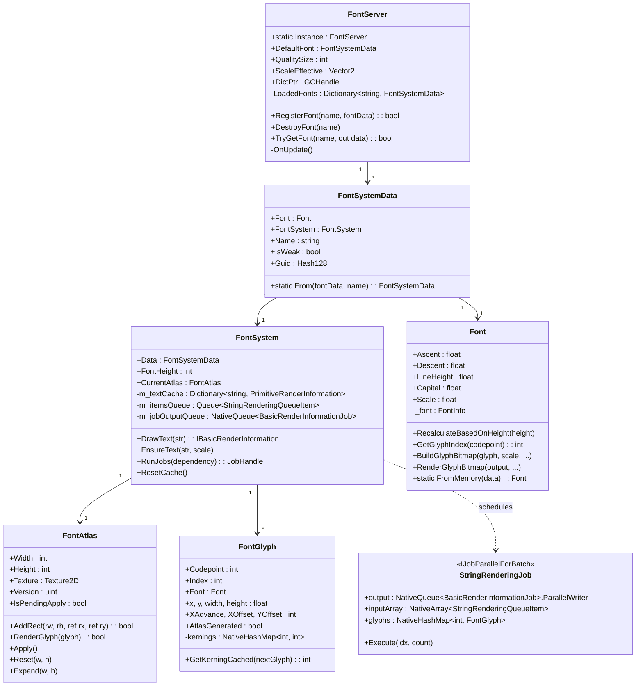
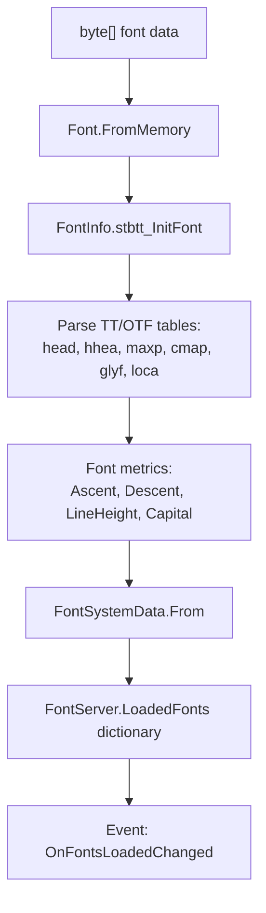
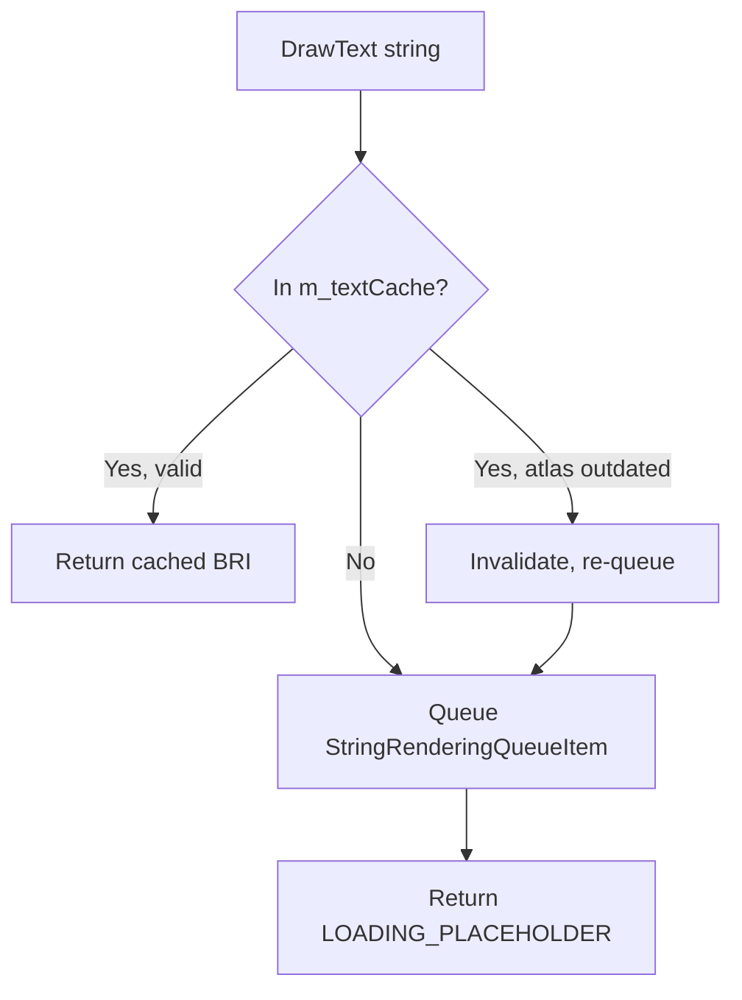
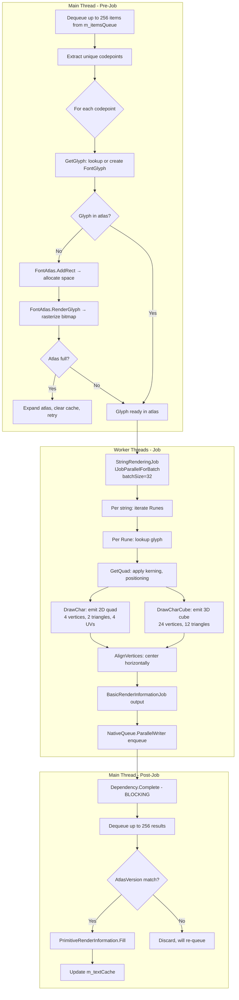
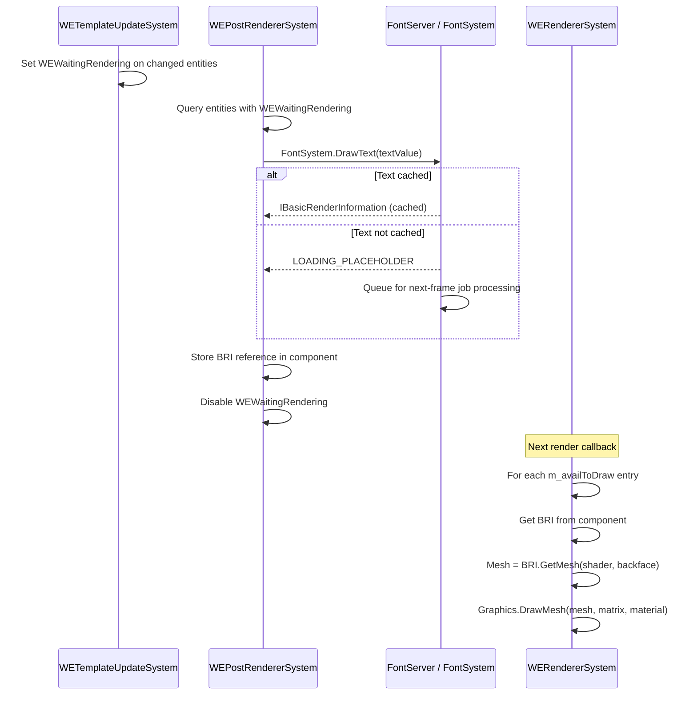

# Font Processing System: Architecture & Pipeline

> **Purpose**: Documents the complete font processing pipeline from font file loading to rendered mesh output, including all data structures, job chains, and the atlas management system.

## System Overview

The font system converts TTF/OTF font files into per-string 3D meshes (vertices, triangles, UVs) that can be rendered via `Graphics.DrawMesh`. It is built on a custom stbtt (STB TrueType) port for glyph rasterization and uses a skyline-packing atlas for texture storage.

## Class Hierarchy



## Processing Pipeline

### Phase 1: Font Registration



### Phase 2: Text Request

When `DrawText(string)` is called:



The `LOADING_PLACEHOLDER` is a sentinel BRI that the renderer checks — if received, it skips rendering that text this frame.

### Phase 3: Job Pipeline (FontServer.OnUpdate → FontSystem.RunJobs)



### Phase 4: Atlas GPU Upload

Every 60 frames (if pending):
```
FontAtlas.IsPendingApply → Texture2D.Apply(false, false) → GPU upload
```

`Texture2D.Apply()` is a synchronous GPU operation that blocks the main thread.

## Memory Layout

### Atlas Packing (Skyline Algorithm)

```
┌────────────────────────────────────────┐
│  ┌──┐ ┌─────┐ ┌──┐                    │
│  │ A│ │  B  │ │C │                     │  ← Skyline level 1
│  │  │ │     │ │  │ ┌───┐ ┌──┐         │
│  │  │ │     │ │  │ │ D │ │E │         │  ← Skyline level 2  
│  │  │ │     │ │  │ │   │ │  │         │
│  └──┘ └─────┘ └──┘ └───┘ └──┘         │
│                                        │
│              Free Space                │
│                                        │
└────────────────────────────────────────┘
   Width: 512-16384 (power of 2)
   Height: same as width
   Format: ARGB32
```

### Glyph Storage

```
Two-level NativeHashMap:
  Level 1: FontHeight (int) → Level 2
  Level 2: Codepoint (int) → FontGlyph struct

Per-glyph kerning: 
  NativeHashMap<int, int> (nextGlyphIndex → kerning value)
```

### Mesh Output per String

Each rendered string produces TWO mesh representations:

| Mesh Type | Vertices | Triangles | Purpose |
|-----------|----------|-----------|---------|
| 2D Quad | 4 per char | 2 per char | Flat decal/billboard rendering |
| 3D Cube | 24 per char | 12 per char | Volumetric text with depth |

For a 10-character string:
- 2D: 40 vertices, 20 triangles, 40 UVs
- 3D: 240 vertices, 120 triangles, 240 UVs
- Colors: per-vertex (top/bottom gradient support)

## Integration with Rendering Pipeline



## Configuration Parameters

| Setting | Default | Range | Effect |
|---------|---------|-------|--------|
| `StartTextureSizeFont` | 1 (1024×1024) | 0-4 (512 to 8192) | Initial atlas size |
| `FontQuality` | 2 (150%) | 0-7 (50%-800%) | Glyph rasterization resolution |

Quality size mapping: `QualitySize = [50, 100, 150, 200, 300, 400, 600, 800][FontQuality]`

Atlas size mapping: `AtlasSize = [512, 1024, 2048, 4096, 8192][StartTextureSizeFont]`
