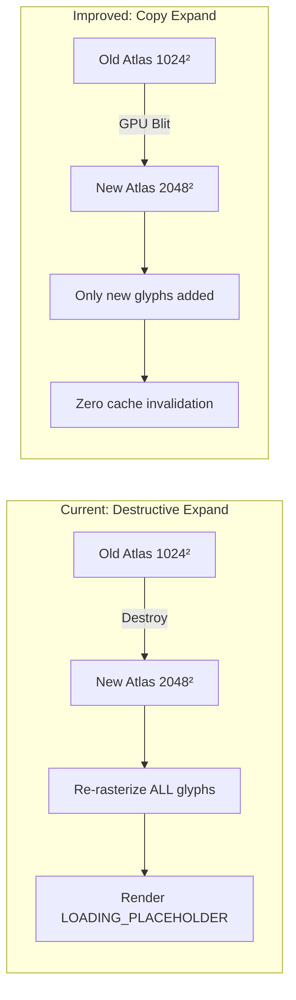
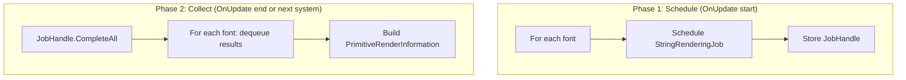

# Font Processing System: Improvement Analysis

> **Purpose**: Evaluates the current font processing system for real improvement opportunities in performance, memory usage, and reliability.

## Current System Strengths

1. **Job-based mesh generation** — `StringRenderingJob` (IJobParallelForBatch) runs glyph-to-mesh conversion on worker threads in parallel.
2. **Skyline packing algorithm** — Efficient bin-packing for glyph placement in the atlas.
3. **Result caching** — `m_textCache` prevents re-rendering identical strings.
4. **Atlas versioning** — Results stamped with `AtlasVersion` are automatically invalidated when the atlas changes.
5. **Batch processing** — Up to 256 strings processed per frame, preventing unbounded work.
6. **Dual mesh output** — Both 2D (decal) and 3D (cube) meshes generated simultaneously.

## Area 1: Atlas Expansion Invalidates All Cached Glyphs

### Problem
When the atlas is full and needs to expand, the system:
1. Destroys the old atlas texture
2. Creates a new, larger texture
3. **Clears all glyphs** — every glyph's `AtlasGenerated` flag is reset
4. **Clears entire text cache** — all `PrimitiveRenderInformation` entries invalidated
5. Re-adds ALL pending and existing glyphs to the new atlas from scratch

This causes:
- Frame spike during mass re-rasterization
- All visible text shows `LOADING_PLACEHOLDER` for 1-2 frames
- Previous work completely wasted

### Assessment
This is the **most impactful bottleneck** in the font system. In a city with 500+ WE text entities using diverse Unicode characters, the initial atlas (1024×1024) may fill up quickly. Each expansion doubles the size but causes a full reset cycle.

### Potential Improvement: Atlas Copy-on-Expand
Instead of clearing the atlas on expansion:
1. Create new larger texture
2. **Copy existing pixel data** to the new texture (blit at [0,0])
3. Update skyline nodes to reflect the new available space
4. Existing glyph UV coordinates remain valid (since they're in the same location)
5. **No cache invalidation** — existing BRIs stay valid



**Implementation**: Use `Graphics.CopyTexture()` (GPU-side blit) to copy the old atlas pixels into the new texture's top-left corner. Adjust the skyline packing state to mark the old region as occupied and the new region as free.

### Verdict: ✅ **Strongly recommended**
This eliminates the most expensive failure mode in the font system. The copy-on-expand approach is standard in production font atlas systems (used by FreeType, HarfBuzz wrappers, and game engines).

## Area 2: Synchronous Job Completion

### Problem
`FontServer.OnUpdate()` calls `FontSystem.RunJobs()` per loaded font, which:
1. Schedules `StringRenderingJob`
2. **Immediately calls** `Dependency.Complete()` — blocks main thread until all strings are rendered
3. Processes results on main thread

For N loaded fonts, this blocks N times sequentially.

### Assessment
The blocking completion prevents the job system from overlapping font work with other systems. In a frame where 3 fonts each have 50 pending strings, the main thread stalls 3 times.

### Potential Improvement: Deferred Completion with Two-Phase Update



This allows all font jobs to run in parallel on worker threads while the main thread continues scheduling.

### Verdict: ⚠️ **Moderate improvement**
Beneficial when multiple fonts are loaded. For single-font usage (the common case with a default font), the gain is minimal since there's only one job to schedule. The implementation is straightforward: collect all `JobHandle`s from `RunJobs()`, then `CompleteAll()` once.

## Area 3: Main-Thread Glyph Rasterization

### Problem
Before scheduling `StringRenderingJob`, the system pre-renders all new glyphs to the atlas **on the main thread**:
```
For each unique codepoint:
    GetGlyph() → font.BuildGlyphBitmap() → atlas.AddRect() → atlas.RenderGlyph()
```

`RenderGlyph` calls `font.RenderGlyphBitmap()` which uses the stbtt rasterizer to produce a pixel bitmap. This is CPU-intensive work happening on the main thread.

### Assessment
Moving glyph rasterization off the main thread would require:
- The stbtt `FontInfo` structure to be thread-safe (it's currently a managed object with internal state)
- Atlas pixel data to be writable from multiple threads simultaneously (requires lock-free write regions)
- Glyph positions to be pre-allocated before rasterization (the current AddRect + RenderGlyph are sequential)

### Potential Improvement: Jobified Glyph Rasterization
1. Pre-allocate all glyph positions on the main thread (`AddRect` for all new codepoints)
2. Create a `NativeArray<byte>` backing the atlas pixels
3. Schedule a parallel job that rasterizes each glyph into its pre-allocated region
4. After job completion, upload the modified pixel regions

**However**: The stbtt rasterizer uses managed `Font` objects and `FakePtr<byte>` wrappers that are incompatible with Burst jobs. A full port to use `NativeArray<byte>` for font data would be required.

### Verdict: Not recommended (high effort)
The glyph rasterization is amortized over time (each glyph renders once, then is cached in the atlas). The main-thread cost is only significant during initial load when many new codepoints appear simultaneously. The atlas copy-on-expand fix (Area 1) would more effectively address load spikes since it eliminates the re-rasterization scenario.

## Area 4: Texture Upload Frequency

### Problem
`FontAtlas.Apply()` calls `Texture2D.Apply(false, false)` which:
- Uploads pixel data from CPU to GPU memory
- Blocks the main thread during upload
- Currently triggered every 60 frames if `IsPendingApply` is true

### Assessment
The 60-frame interval is a reasonable compromise. However, during rapid text changes (e.g., dynamic counters updating every frame), new glyphs may be rendered to the atlas but not visible until up to 60 frames later because the GPU still has the old texture data.

### Potential Improvement: Adaptive Upload Frequency
- If many new glyphs were added this frame: upload immediately
- If no new glyphs: skip upload entirely
- If a few glyphs: maintain 60-frame interval

Additionally, `Texture2D.Apply(false, true)` with `makeNoLongerReadable = true` could be used in steady state (all glyphs rendered) to free CPU-side memory. But this would prevent future glyph additions.

### Verdict: ⚠️ **Minor improvement possible**
Adaptive upload based on glyph count changes would improve responsiveness. The current 60-frame interval is adequate for most use cases. The improvement is only noticeable when many new characters appear rapidly (first few seconds after loading).

## Area 5: Per-Glyph Kerning Maps

### Problem
Each `FontGlyph` has its own `NativeHashMap<int, int>` for kerning values:
```
600 glyphs × (NativeHashMap overhead + N kerning pairs) = significant memory
```

The `GetKerningCached` method lazily populates this map per glyph pair encountered.

### Assessment
For Latin scripts, a typical font has ~200 kerning pairs spread across ~50 common glyphs. For CJK/Unicode fonts, kerning is rare. The per-glyph maps are mostly empty.

### Potential Improvement: Shared Kerning Table
Replace per-glyph `NativeHashMap<int, int>` with a single font-level `NativeHashMap<long, int>` where the key encodes both glyph indices:
```
key = (long)leftGlyphIndex << 32 | (long)rightGlyphIndex
```

Benefits:
- Single allocation instead of N allocations
- Better cache locality for iteration
- Trivially disposable (one Dispose call instead of N)

### Verdict: ⚠️ **Minor improvement possible**
Reduces memory fragmentation and simplifies disposal. The actual memory savings depend on glyph count and kerning density. For typical Latin fonts: ~50 NativeHashMap allocations ≈ ~10KB saved. For CJK fonts: more significant savings due to larger glyph sets but fewer kerning pairs.

## Area 6: String Length Limitation

### Problem
`StringRenderingJob` uses `FixedString512Bytes` for text data:
- Maximum ~500 characters (UTF-8 characters vary in byte width)
- Longer strings are silently truncated
- No mechanism to detect or handle truncation

### Assessment
For typical use cases (street names, building names, route numbers), 500 characters is more than sufficient. However, templates that combine multiple dynamic fields into a single text element could potentially exceed this.

### Verdict: No change recommended
The 500-character limit is appropriate for the use case. The fixed-size buffer enables Burst-compatible jobs without managed string allocations. Raising the limit (e.g., `FixedString4096Bytes`) would increase per-job memory usage for all strings, not just long ones.

## Summary

| ID | Area | Opportunity | Recommendation | Impact |
|----|------|------------|----------------|--------|
| 1 | Atlas expansion clear | Copy-on-expand | **Strongly recommended** | High — eliminates worst-case stalls |
| 2 | Synchronous job completion | Deferred completion | Moderate improvement | Medium — helps multi-font setups |
| 3 | Main-thread glyph raster | Jobified raster | Not recommended | High effort, amortized cost |
| 4 | Texture upload frequency | Adaptive upload | Minor improvement | Low — 60-frame is adequate |
| 5 | Per-glyph kerning maps | Shared kerning table | Minor improvement | Low — memory optimization |
| 6 | String length limit | Larger FixedString | No change | Not needed |

## Conclusion

The font system's most impactful improvement opportunity is **atlas copy-on-expand** — avoiding the destructive clear-all-and-re-rasterize cycle when the atlas needs to grow. This single change would eliminate the most visible user-facing issue (text disappearing momentarily) and the largest performance spike (mass glyph re-rasterization).

The deferred job completion improvement is worth implementing if multi-font usage is expected, and the shared kerning table is a clean optimization that simplifies memory management. The other areas are either too high-effort for the return (jobified rasterization) or already adequate (upload frequency, string limits).
