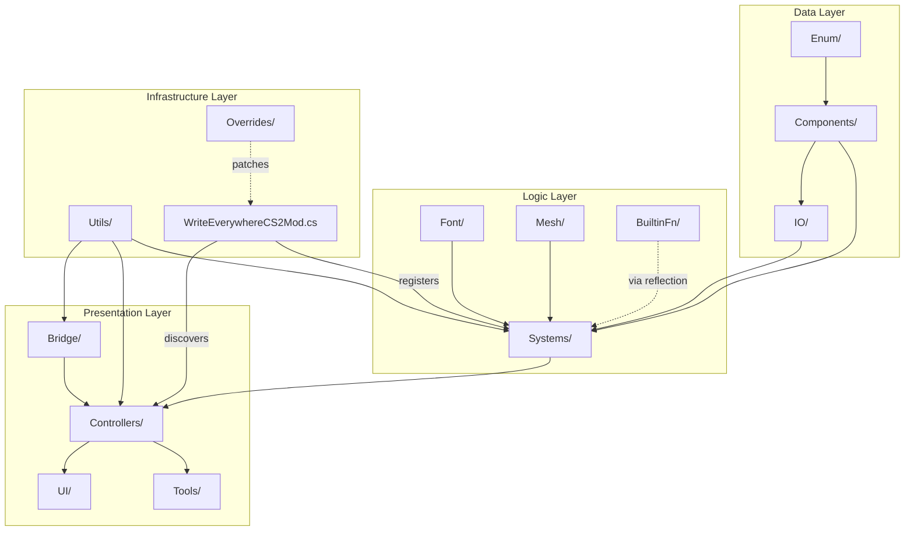

# Overall Mod Structure: Directory Organization & Responsibilities

> **Purpose**: Maps the complete directory structure and the responsibilities of each folder, providing a reference for understanding where code belongs and how the pieces connect.

## Top-Level Directory Map

```
BelzontWE/
├── Bridge/          [7 files]   Game API adapters
├── BuiltinFn/       [14 files]  Formula function registries
├── Components/      [12+ files] ECS component definitions
├── Controllers/     [15 files]  UI binding & system coordination
├── Enum/            [3 files]   Enumeration types
├── Font/            [4 dirs]    Font file parsing, rendering, atlas management
├── i18n/            [5 files]   Localization data
├── IO/              [11 files]  File I/O & serialization formats
├── Library/         [1 file]    IL post-processor marker
├── Mesh/            [4 files]   Mesh rendering interfaces & library
├── Overrides/       [3 files]   Harmony patches for game systems
├── Properties/      []          Assembly metadata
├── Resources/       [1 file]    Embedded assets (default font)
├── Screenshots/     []          Marketing assets
├── Systems/         [10+ files] ECS systems + Templates subfolder
├── Tools/           [2 files]   Editor tools
├── UI/              [3 items]   UI panels + images
├── Utils/           [7 files]   Reusable helpers
├── WEModData.cs                 Settings & keybindings
└── WriteEverywhereCS2Mod.cs     Mod entry point
```

## Folder Responsibility Matrix

| Folder | Depends On | Depended By | Responsibility |
|--------|-----------|-------------|----------------|
| **Components/** | Enum/ | Systems/, Controllers/, IO/, BuiltinFn/ | Define ECS data structures. Pure data, no behavior. |
| **Systems/** | Components/, Font/, Mesh/, Utils/ | Controllers/ (via GetSystem) | ECS update logic, rendering, culling, templates |
| **Controllers/** | Components/, Systems/, Utils/, Bridge/ | UI/, Tools/ | UI data binding, user interaction coordination |
| **Bridge/** | Utils/ | Controllers/ | Adapt game APIs for mod consumption |
| **BuiltinFn/** | — (stateless) | Utils/ (via reflection), Formulae system | Static functions callable from formulas |
| **Font/** | — (self-contained) | Systems/, Controllers/ | Font parsing, glyph raster, mesh generation |
| **Mesh/** | — (self-contained) | Systems/, Font/ | Rendering mesh interfaces and library |
| **IO/** | Components/ | Systems/, Controllers/ | XML serialization, file formats, type descriptors |
| **Enum/** | — | Components/, Systems/ | Shared enumeration types |
| **Utils/** | — | All folders | Cross-cutting utilities |
| **Overrides/** | — (Harmony) | — | Game system patches (isolated) |
| **Tools/** | Controllers/ | — | World picker tool |
| **UI/** | Controllers/ | — | Main panel, editor tool panel |
| **i18n/** | — | — (loaded at runtime) | Localization strings |

## Data Flow Between Folders



## Key Architectural Patterns

### 1. IBelzontBindable — Three-Phase UI Registration
All controllers implement `IBelzontBindable` with three setup phases:
- **Phase 1** `SetupCaller()`: Register event emitters (C# → UI)
- **Phase 2** `SetupEventBinder()`: Register event listeners (UI → C#)
- **Phase 3** `SetupCallBinder()`: Register callable methods (UI → C#, one-way)

### 2. Partial Class Pattern (WETemplateManager)
The largest system is split across 7 partial files by subdomain:
```
WETemplateManager.cs                    [core orchestration]
WETemplateManager.CityTemplates.cs      [savegame persistence]
WETemplateManager.EntityProcessing.cs   [ECS entity lifecycle]
WETemplateManager.ModSubTemplates.cs    [mod resource loading]
WETemplateManager.ModulesIntegration.cs [module system]
WETemplateManager.PrefabLayout.cs       [prefab attachment]
WETemplateManager.SystemCommunication.cs[cross-system messaging]
```

### 3. Singleton Pattern
Used consistently for unique-instance systems:
- `FontServer.Instance`
- `WEStringsBank.Instance`
- `WEVarsCacheBank.Instance`
- `WETemplateManager.Instance`
- `BasicIMod.Instance`

### 4. Flat ECS Component Composition
Text entities use multiple independent components rather than nested/inherited structures:
```
Entity = WETextDataMain + WETextDataTransform + WETextDataMaterial + 
         WETextDataMesh + WETextDataVariable[] + WETextComponentValid
```

### 5. BelzontBasicSystem Base Class
Common base for ECS systems that provides:
- Safe command buffer access
- Phase management via `AllowedPhase` enum
- Barrier registration
- Lifecycle hooks (`OnCreateWithBarrier`)

### 6. Bridge Pattern for Game APIs
Bridge classes isolate game API access:
```
Controllers → Bridge → Game API
```
This allows game API changes to be absorbed in the Bridge layer without affecting controllers.

## Commons Library (BelzontWE.Commons)

Shared foundation library used across BelzontWE:

```
BelzontCommons/
├── IBelzontBasicSystem.cs       Base system interface & abstract class
├── IBelzontBindable.cs          UI binding protocol
├── IBelzontToolSystem.cs        Tool system protocol
├── Utils/                       [36 files] 
│   ├── BasicIMod.cs             Mod lifecycle management
│   ├── BasicModData.cs          Settings base
│   ├── Redirector.cs            Harmony patching framework
│   ├── ReflectionUtils.cs       Type discovery & instantiation
│   ├── EntityManagerExtensions.cs   ECS helpers
│   └── ... (31 more utility files)
├── UI/                          [3 files]
│   ├── DataBaseController.cs    Base UI system
│   ├── MultiUIValueBinding.cs   Typed UI bindings
│   └── UIColorRGBA.cs           Color type for UI
├── Serialization/               Odin serializer support
├── Assets/                      Asset database helpers
└── AssemblyUtility/             Assembly reflection & metadata
```

## Naming Conventions

| Prefix/Pattern | Meaning | Examples |
|----------------|---------|----------|
| `WE*System` | ECS system | `WERendererSystem`, `WEPreCullingSystem` |
| `WE*Controller` | UI binding controller | `WELayoutController` |
| `WE*Tool` | Editor tool | `WEWorldPickerTool` |
| `WE*Library` | Asset/resource cache | `WEAtlasesLibrary`, `WECustomMeshLibrary` |
| `WE*Bank` | Data cache pool | `WEStringsBank`, `WEVarsCacheBank` |
| `WE*Bridge` | Game API adapter | `FontManagementBridge` |
| `WETextData*` | ECS component | `WETextDataMain`, `WETextDataMaterial` |
| `WE*Fn` | Formula function class | `WEBuildingFn`, `WERoadFn` |
| `WE*Override` | Harmony patch | `AssetUploadOverrides` |
