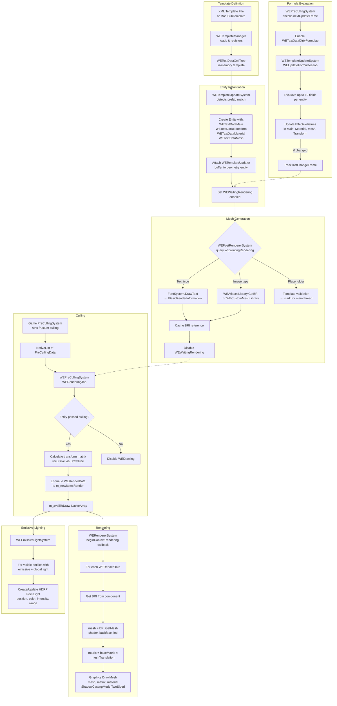
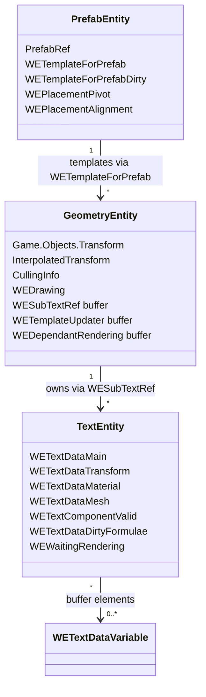

# Overall Mod Structure: Rendering Pipeline End-to-End

> **Purpose**: Documents the complete rendering pipeline from entity creation to pixels on screen, crossing all system boundaries. Serves as a reference for understanding how all the pieces connect.

## End-to-End Flow



## Frame Execution Order (Summary)

```
1. MainLoop          → WEPostRendererSystem (mesh cache), WEEmissiveLightSystem
2. Modification1     → WENodeExtraDataUpdater (node cache)
3. Modification2B    → WENodeExtraDataUpdater2B (cache invalidation)
4. ModificationEnd   → WEWorldPickerController (selection state)
5. Rendering         → FontServer → Atlases → Meshes → Templates chain
6. UIUpdate          → UI systems
7. UITooltip         → Tooltip system
8. PreCulling        → WEPreCullingSystem (visibility + render list)
9. Unity Callback    → WERendererSystem (actual Graphics.DrawMesh calls)
```

## Entity Component Architecture



## Cross-System Data Dependencies

| Producer System | Data Produced | Consumer System | Phase Gap |
|----------------|---------------|-----------------|-----------|
| WENodeExtraDataUpdater | WENetNodeInformation | WERoadFn (via formulas) | Mod1 → Rendering |
| WEWorldPickerController | Selected entity | WEPreCullingSystem | ModEnd → PreCulling |
| FontServer | IBasicRenderInformation | WEPostRendererSystem | Rendering → MainLoop(next) |
| WETemplateManager | Template data | WETemplateUpdateSystem | Rendering (ordered) |
| WETemplateUpdateSystem | Updated components | WEPostRendererSystem | Rendering → MainLoop(next) |
| WEPreCullingSystem | m_availToDraw | WERendererSystem | PreCulling → Unity callback |
| WEPreCullingSystem | m_availToDraw | WEEmissiveLightSystem | PreCulling → MainLoop(next) |
| Game PreCullingSystem | PreCullingData | WEPreCullingSystem | Same phase |

Note: "MainLoop(next)" means the data is consumed in the following frame's MainLoop phase, introducing one frame of latency.
