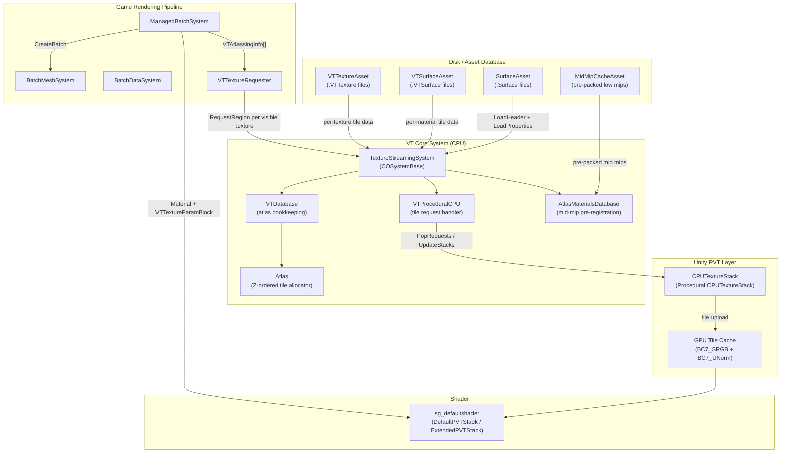
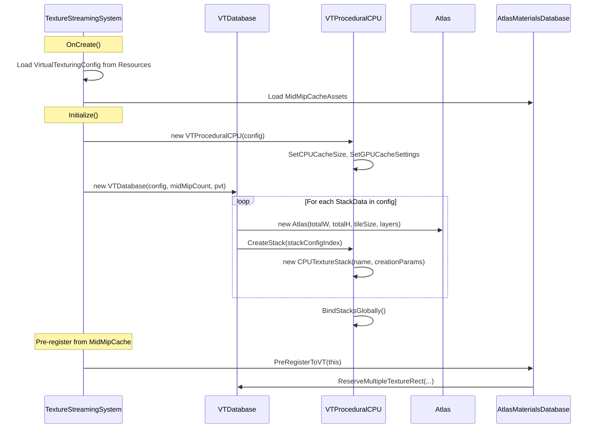
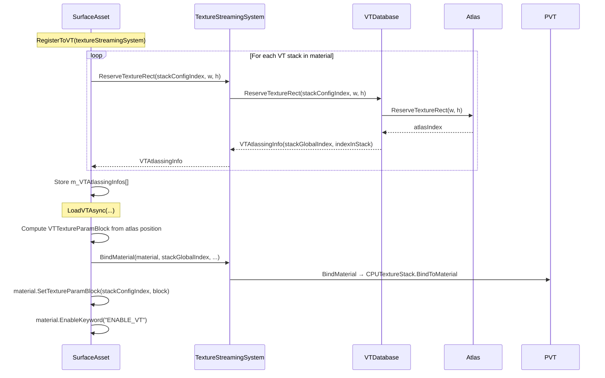
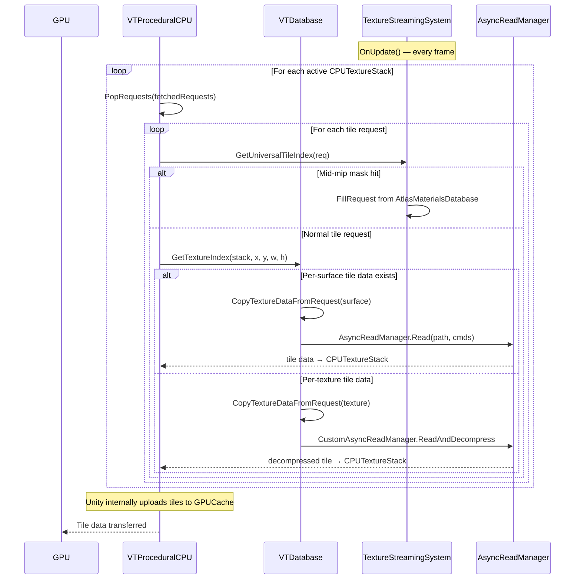
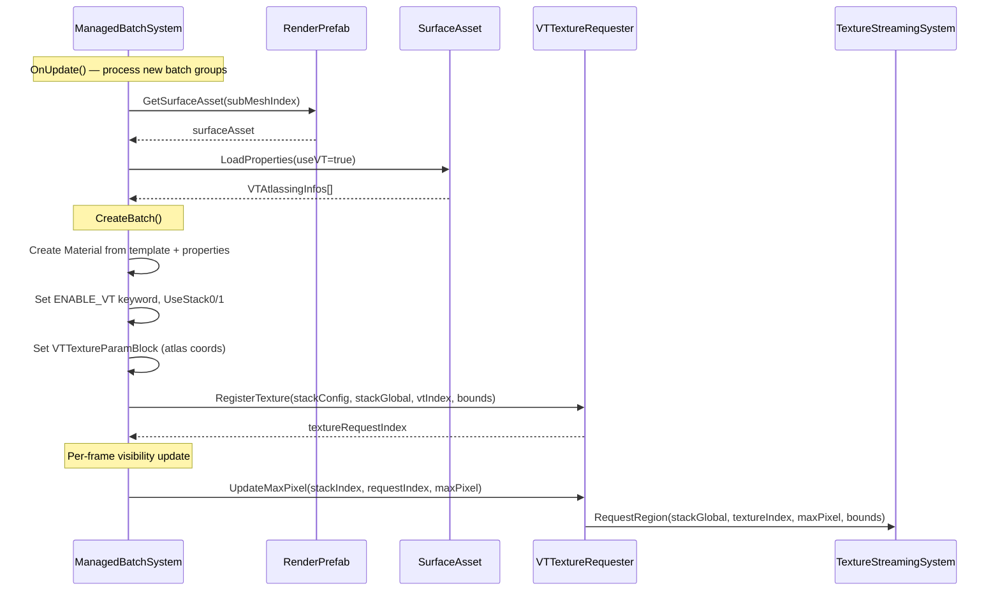

# 01 — VT Architecture and Rendering Pipeline

> **Purpose**: End-to-end documentation of how CS2 renders asset textures, from file-on-disk to rendered pixel, with emphasis on the Virtual Texturing (VT) system.

## High-Level Architecture

CS2 uses Unity's **Procedural Virtual Texturing (PVT)** system in CPU mode. This means textures are NOT loaded in full to VRAM. Instead:

1. Textures are stored as **tiled, BC7-compressed** data on disk (`.VTSurface` files)
2. At load time, each material **reserves a rectangular region** in a virtual atlas (2048×2048 tiles)
3. At runtime, the GPU **requests tiles** as-needed based on what's visible on screen
4. The CPU **decompresses and uploads** only the requested tiles to a GPU tile cache

## System Component Overview

## Data Flow: Asset Load to Rendered Pixel

### Phase 1 — System Initialization

### Phase 2 — Material Registration (per SurfaceAsset)

### Phase 3 — Runtime Tile Streaming

### Phase 4 — Batch Creation and Rendering

## Key Data Structures

### VirtualTexturingConfig (ScriptableObject — loaded from Resources)

| Field | Type | Description |
|-------|------|-------------|
| `tileSize` | `int` | Tile dimension in pixels (typically 128) |
| `stackDatas` | `StackData[]` | Per-stack name + layer formats |
| `cpuCacheSize` | `int` | CPU-side tile cache in MB |
| `bc7GPUCacheSize` | `uint` | GPU cache for BC7_SRGB in MB |
| `bc7UNormGPUCacheSize` | `uint` | GPU cache for BC7_UNorm in MB |
| `filterMode` | `FilterMode` | Bilinear or Trilinear |
| `maxTextureSize` | `int` | Max individual texture size in atlas |

Total virtual atlas size: `2048 × tileSize` per dimension (e.g., 262144 px if tileSize=128).

### StackData

| Field | Type | Description |
|-------|------|-------------|
| `stackName` | `string` | E.g. `"DefaultPVTStack"`, `"ExtendedPVTStack"` |
| `layerFormats` | `GraphicsFormat[]` | E.g. `[BC7_SRGB, BC7_SRGB, BC7_UNorm, BC7_SRGB]` |

The default shader (`sg_defaultshader`) uses **two stacks**:
- **Stack 0 — DefaultPVTStack (4 layers)**: `_BaseColorMap`, `_MaskMap`, `_NormalMap`, + 1 more (likely snow)
- **Stack 1 — ExtendedPVTStack (1 layer)**: Additional texture layer

### VTAtlassingInfo

| Field | Type | Description |
|-------|------|-------------|
| `stackGlobalIndex` | `int` | Which atlas instance this texture lives in |
| `indexInStack` | `int` | Z-ordered index within the atlas |
| `addressMode` | `VTAddressMode` | Clamp (most cases) |

### VTTextureParamBlock

| Field | Type | Description |
|-------|------|-------------|
| `transform` | `float4` | `(offsetX, offsetY, scaleX, scaleY)` — atlas UV transform |
| `textureInfo` | `float4` | `(maxMipLevel, 1.0, 1.0, 2.0)` typically |

This struct is set as shader properties `DefaultPVTStack_atlasParams0/1` (or `ExtendedPVTStack_atlasParams0/1`).

### Shader Properties for VT

| Property | Meaning |
|----------|---------|
| `_UseStack0` | Float toggle: 1 = sample from VT stack 0 |
| `_UseStack1` | Float toggle: 1 = sample from VT stack 1 |
| `ENABLE_VT` | Shader keyword: enables VT sampling path |
| `DefaultPVTStack_atlasParams0` | VTTextureParamBlock.transform |
| `DefaultPVTStack_atlasParams1` | VTTextureParamBlock.textureInfo |
| `_BaseColorMap` | Fallback albedo texture (used when VT disabled) |
| `_NormalMap` | Fallback normal map |
| `_MaskMap` | Fallback mask map |

## Summary: Key Insight for Modding

The entire VT system operates at the **SurfaceAsset / Material level**. Each material has:

1. A reference to a template shader (with VT support baked in)
2. VT atlas coordinates (VTTextureParamBlock) set as material properties
3. An `ENABLE_VT` keyword that toggles between VT sampling and direct Texture2D sampling
4. Fallback `_BaseColorMap`, `_NormalMap`, `_MaskMap` texture properties that are **only used when VT is disabled**

This dual-path architecture in the shader is the primary modding hook — disabling VT on a material re-enables direct texture binding.
