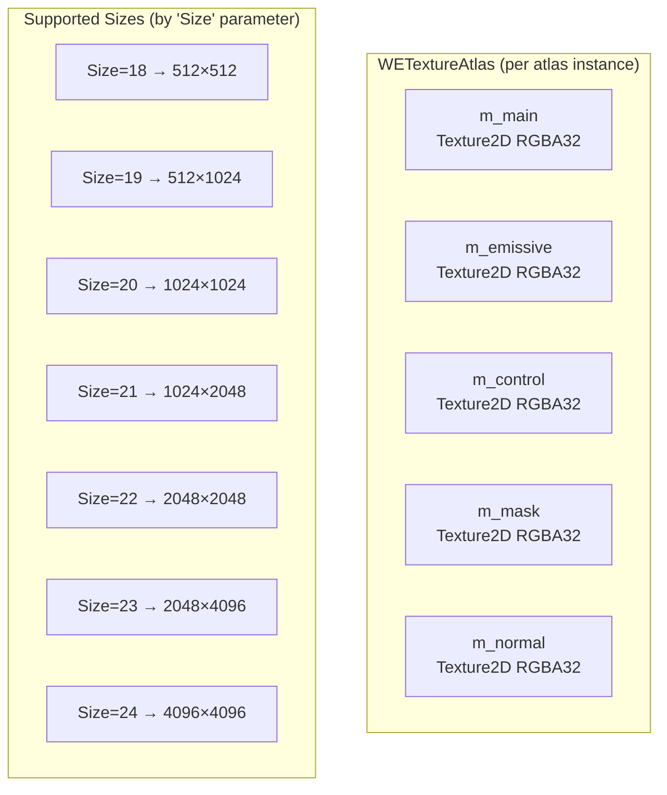
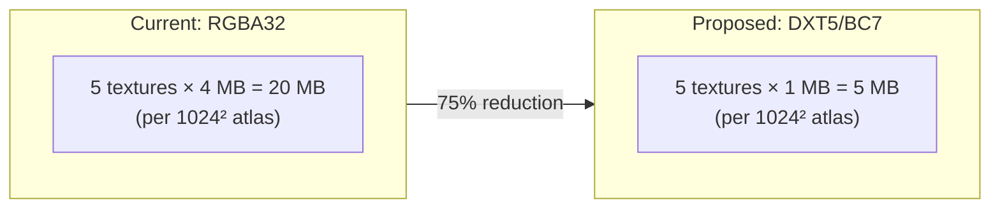
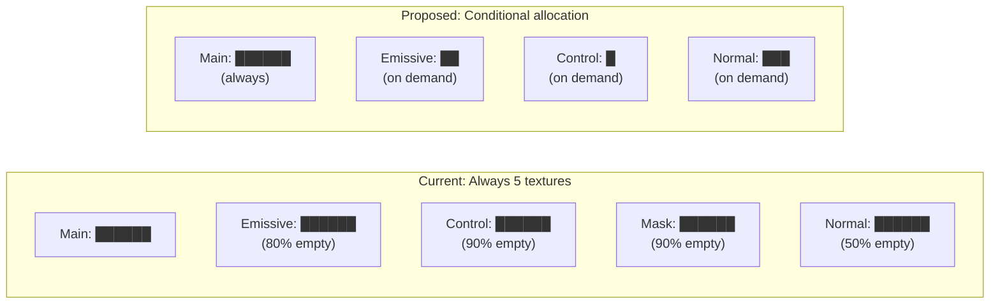
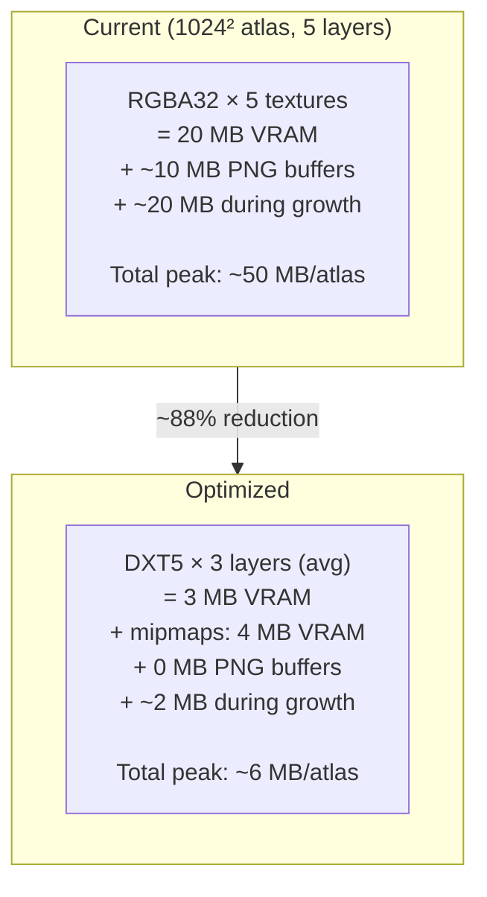

# 07 — Atlas Memory Optimizations (Current WE Mod)

> **Purpose**: Analyze the current BelzontWE atlas memory footprint and identify concrete optimization opportunities to reduce RAM/VRAM usage before introducing vehicle skin functionality.

## Current Memory Architecture

### WETextureAtlas — Image Atlases

The `WETextureAtlas` class maintains **5 separate `Texture2D` objects** per atlas, all in `RGBA32` format (uncompressed, 4 bytes/pixel):



**Memory cost per atlas (5 textures × RGBA32):**

| Size | Dimensions | Pixels | Per Texture (RGBA32) | × 5 Textures | Total |
|------|-----------|--------|---------------------|---------------|-------|
| 18 | 512×512 | 262K | 1 MB | 5 MB | **5 MB** |
| 19 | 512×1024 | 524K | 2 MB | 10 MB | **10 MB** |
| 20 | 1024×1024 | 1M | 4 MB | 20 MB | **20 MB** |
| 21 | 1024×2048 | 2M | 8 MB | 40 MB | **40 MB** |
| 22 | 2048×2048 | 4M | 16 MB | 80 MB | **80 MB** |
| 23 | 2048×4096 | 8M | 32 MB | 160 MB | **160 MB** |
| 24 | 4096×4096 | 16M | 64 MB | 320 MB | **320 MB** |

The atlas starts at Size=18 and **doubles** when full (up to Size=24):

```csharp
// From RegisterAtlas():
while (targetDict[atlasName].Insert(entry) == 2)
{
    var currentSize = targetDict[atlasName].Size;
    if (currentSize >= 24) break;
    var newAtlas = new WETextureAtlas(currentSize + 1);
    newAtlas.InsertAll(targetDict[atlasName]); // re-inserts all sprites
    // ...
}
```

**Problem**: During growth, both old and new atlas exist simultaneously, temporarily doubling memory.

Additionally, serialized atlases store **PNG-encoded copies** in `m_serializationOrder`:
```csharp
m_serializationOrder = new byte[][]
{
    m_main.EncodeToPNG(),      // RAM-only duplicate
    m_emissive.EncodeToPNG(),
    m_control.EncodeToPNG(),
    m_mask.EncodeToPNG(),
    m_normal.EncodeToPNG(),
};
```

### FontAtlas — Font Glyph Atlases

Font atlases use `ARGB32` (also 4 bytes/pixel), with default size from `FontServer.DefaultTextureSizeFont`:

```csharp
public static int DefaultTextureSizeFont => 512 << (WEModData.InstanceWE?.StartTextureSizeFont ?? 1);
// Default: 512 << 1 = 1024
```

Font atlas **grows dynamically** via `ExpandWithCopy()` when running out of space, doubling dimensions. A 1024×1024 ARGB32 texture = 4 MB per font.

### Total Memory Estimate (Typical Usage)

| Source | Count | Size (each) | Total |
|--------|-------|-------------|-------|
| Local image atlases | ~5 | 20–80 MB | 100–400 MB |
| City/save atlases | ~2 | 20–80 MB | 40–160 MB |
| Mod integration atlases | ~3 | 20–80 MB | 60–240 MB |
| Font atlases | ~5 | 4–16 MB | 20–80 MB |
| PNG serialization buffers | ~2 atlases | 10–40 MB | 20–80 MB |
| **Total** | | | **240–960 MB** |

## Identified Optimization Opportunities

### Optimization 1: Use DXT5/BC7 Compression

**Impact**: 4:1 to 8:1 reduction in GPU memory.

Currently all textures use `RGBA32` (uncompressed). Switching to `DXT5` (BC3) or `BC7` would dramatically reduce VRAM:

| Format | Bytes/Pixel | 1024² Texture | Reduction |
|--------|------------|---------------|-----------|
| RGBA32 | 4.0 | 4 MB | baseline |
| DXT5 (BC3) | 1.0 | 1 MB | **75%** |
| BC7 | 1.0 | 1 MB | **75%** |
| DXT1 (BC1) | 0.5 | 0.5 MB | **87.5%** |



**Implementation approach**:
```csharp
// After assembling atlas in RGBA32:
m_main.Compress(true); // Unity built-in DXT compression
// Or use Texture2D constructor with compressed format:
var compressed = new Texture2D(Width, Height, TextureFormat.DXT5, false);
Graphics.ConvertTexture(m_main, compressed);
Object.Destroy(m_main);
m_main = compressed;
```

**Caveats**:
- `Texture2D.Compress()` is lossy — may introduce artifacts on sharp edges
- Compressed textures are **not readable** (`GetPixels()` fails) — must compress AFTER all writes are complete
- `Insert()` currently calls `SetPixels()` on the atlas → must keep RGBA32 staging texture, compress on `Apply()`

**Suggested pattern**:
```csharp
public void Apply()
{
    // 1. Apply uncompressed staging textures
    m_mainStaging.Apply();
    
    // 2. Compress to GPU-friendly format
    m_main = CompressTexture(m_mainStaging, sRGB: true);
    
    // 3. Keep staging only if writable
    if (!IsWritable) Object.Destroy(m_mainStaging);
}
```

### Optimization 2: Eliminate Unused Texture Layers

**Impact**: Up to 60% reduction for sprites without extra maps.

Each atlas allocates 5 textures regardless of whether sprites use emissive/control/mask/normal maps. The `HasEmissive`, `HasControl`, etc. flags exist but the full texture layer is always allocated.



**Implementation**: Defer creation of emissive/control/mask/normal textures until a sprite that needs them is actually inserted. The shader can use fallback constants (white, flat normal) when a map is absent.

### Optimization 3: Split Serialization from Runtime

**Impact**: ~20-40 MB RAM for typical save scenarios.

Currently `Apply()` encodes all 5 textures to PNG and stores the byte arrays in `m_serializationOrder`. These buffers live in RAM until the atlas is disposed.

**Fix**: Encode to PNG only during `Serialize()`, not during `Apply()`. If textures are compressed (Optimization 1), keep a compressed readable copy OR re-read from GPU when serializing.

```csharp
// Current:
public void Apply()
{
    m_main.Apply();
    m_serializationOrder = new byte[][] {
        m_main.EncodeToPNG(), // ← huge RAM allocation, kept forever
        // ...
    };
}

// Proposed:
public void Serialize<TWriter>(TWriter writer) where TWriter : IWriter
{
    // Encode only when actually saving
    var mainBytes = m_main.MakeReadable(out var copy).EncodeToPNG();
    writer.Write(mainBytes.Length);
    writer.Write(mainBytes);
    if (copy) Object.Destroy(copy);
    // ... repeat for other textures
}
```

### Optimization 4: Atlas Growth Without Full Rebuild

**Impact**: Eliminates transient 2× memory spike during atlas growth.

Currently, when an atlas is full, a new larger atlas is created and ALL sprites are re-inserted from scratch (reading pixels from old → writing to new). Both old and new atlases exist simultaneously.

**Proposed**: Use `Graphics.CopyTexture()` to blit the old atlas content to the new larger one directly on the GPU, then extend the bin packing free space.

```csharp
public void Grow()
{
    int newW = Width * 2;  // or according to Size parameter logic
    int newH = Height * 2;
    
    var newMain = new Texture2D(newW, newH, TextureFormat.RGBA32, false);
    Graphics.CopyTexture(m_main, 0, 0, 0, 0, Width, Height,
                         newMain, 0, 0, 0, 0);
    Object.Destroy(m_main);
    m_main = newMain;
    
    // Extend MaxRectsBinPack free space
    rectsPack.Expand(newW, newH);
}
```

### Optimization 5: Mipmap Generation

**Impact**: ~33% increase in VRAM but significant rendering quality improvement. If compression is applied, net effect is still a major reduction.

Currently `mipChain: false` is used everywhere:
```csharp
m_main = new Texture2D(Width, Height, TextureFormat.RGBA32, false); // no mipmaps
```

Adding mipmaps costs 33% more memory but dramatically improves rendering at distance (important for in-game text/signs). With DXT5 compression + mipmaps, total is still less than RGBA32 without mipmaps:

| Config | 1024² per texture | × 5 |
|--------|-------------------|-----|
| RGBA32, no mips | 4 MB | 20 MB |
| DXT5, with mips | 1.33 MB | 6.65 MB |

### Summary: Combined Optimization Impact



For 10 atlases: **~500 MB → ~60 MB**. This freed memory budget directly enables the Vehicle Skins feature.

## Prioritized Implementation Order

| # | Optimization | Effort | Impact | Priority |
|---|-------------|--------|--------|----------|
| 1 | DXT5/BC7 compression on Apply() | Medium | 75% VRAM | **P1** |
| 2 | Lazy texture layer allocation | Low | 20-60% VRAM | **P1** |
| 3 | Deferred PNG serialization | Low | 20-40 MB RAM | **P2** |
| 4 | GPU-based atlas growth | Medium | Peak memory spike | **P2** |
| 5 | Mipmap generation | Low | Quality + DXT savings | **P3** |

## Font Atlas Specific Note

The `FontAtlas` class uses `ARGB32` and has similar issues but is less critical because:
- Font atlases are smaller (typically 1024²) 
- There's only one texture per font (not 5)
- The glyph rendering pipeline writes individual pixels, making compression harder to apply incrementally

However, the same **compress-on-demand** pattern could apply: keep ARGB32 staging, compress to DXT1 (font glyphs are single-channel effectively) when the atlas is stable.
