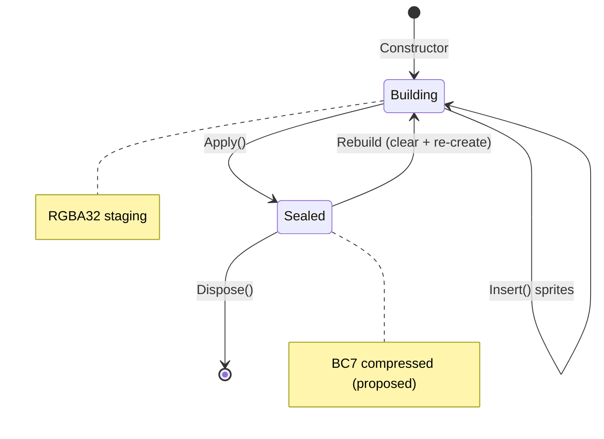
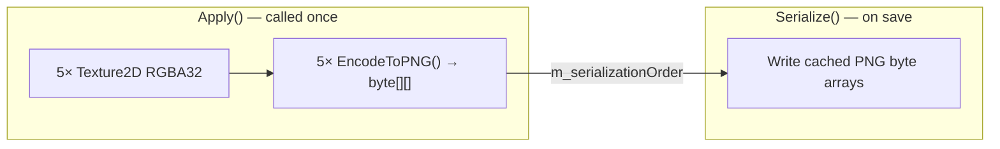
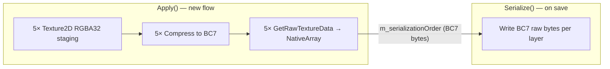
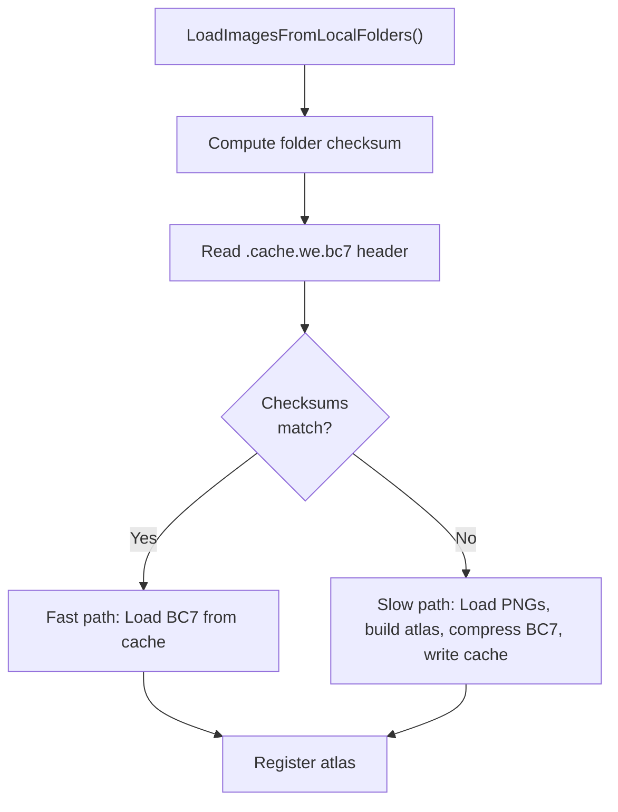
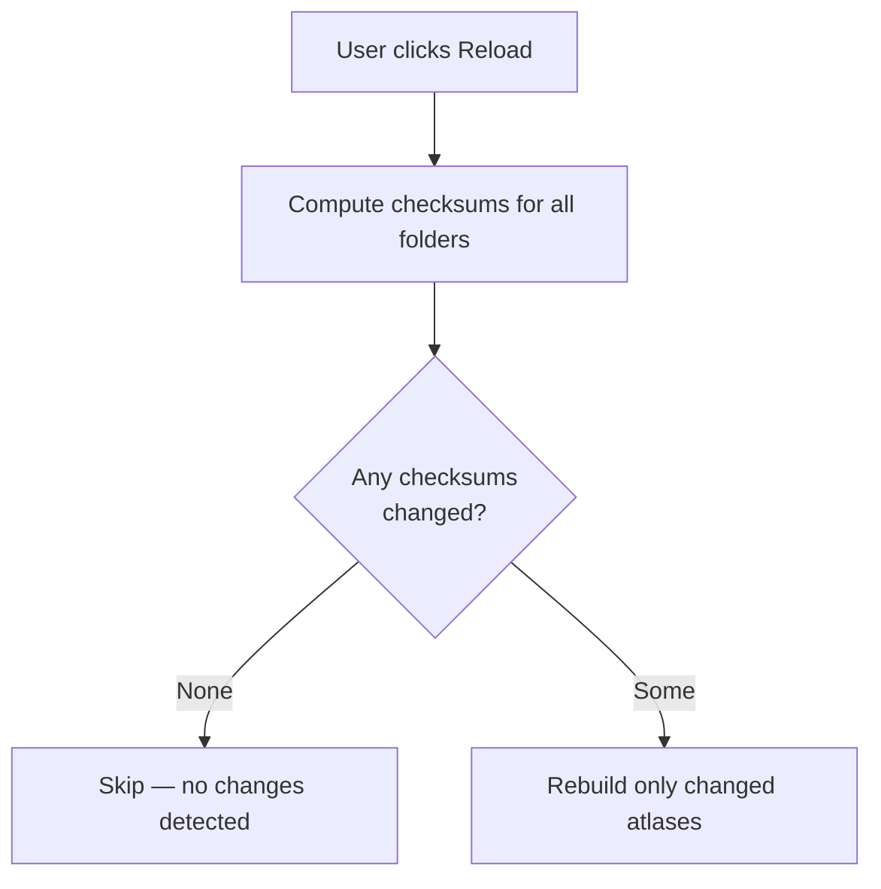
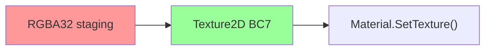
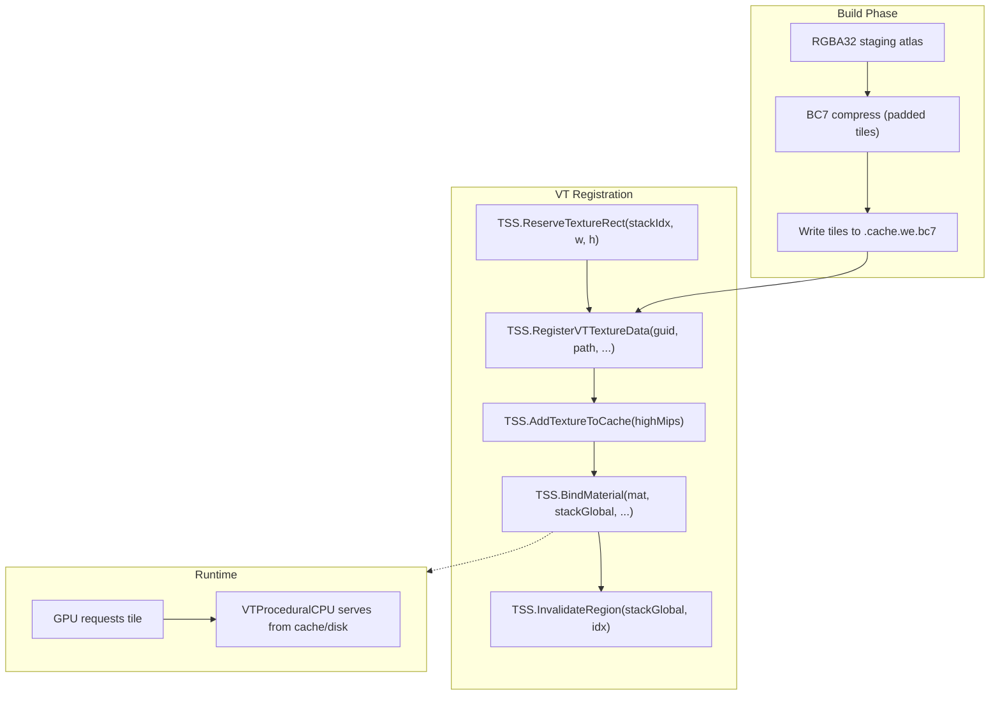
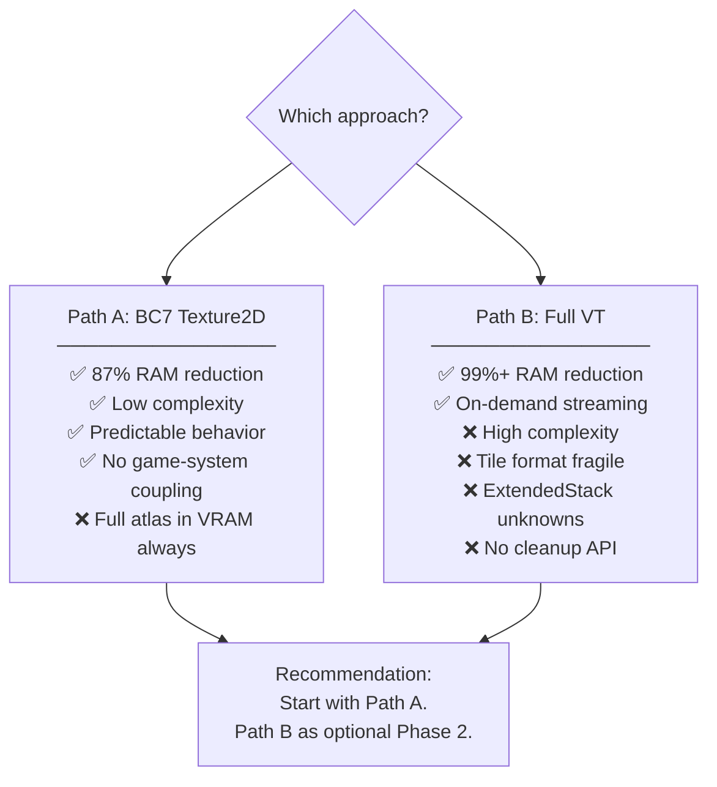
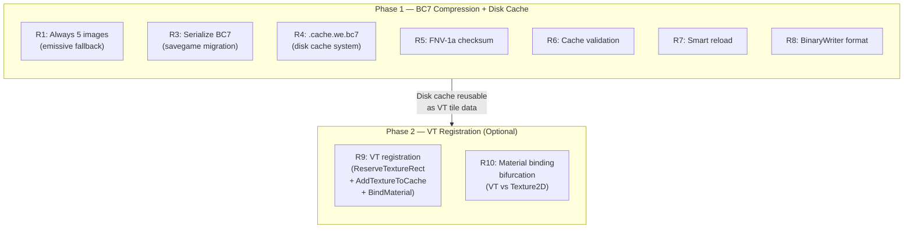

# 03 — Atlas VT Action Plan: Feasibility Assessment

> **Purpose**: Validate the user's proposed action plan for converting WE image atlases to use BC7 compression, disk caching, and VT registration. Each requirement is assessed for feasibility, risks, and implementation approach.

## Requirements Matrix

| # | Requirement | Verdict | Complexity |
|---|------------|---------|------------|
| R1 | Always 5 images per atlas | **FEASIBLE** | Low |
| R2 | Atlases immutable after loading | **CONFIRMED** | None (already true) |
| R3 | Savegame saves compressed images | **FEASIBLE** | Medium |
| R4 | BC7 disk cache per folder | **FEASIBLE** | Medium |
| R5 | Checksum: filenames + file sizes | **FEASIBLE** | Low |
| R6 | Cache validation on load | **FEASIBLE** | Low |
| R7 | UI reload checks checksum first | **FEASIBLE** | Low |
| R8 | Cache uses game's ISerialize | **FEASIBLE** | Low |
| R9 | Register atlases to VT | **FEASIBLE WITH CAVEATS** | High |
| R10 | VT changes material binding (impacts fonts) | **CONFIRMED** | Medium |

---

## R1 — Always 5 Images Per Atlas

### Current Behavior

`WETextureAtlas` constructor already creates all 5 textures unconditionally:

```csharp
m_main     = new Texture2D(Width, Height, TextureFormat.RGBA32, false);
m_emissive = new Texture2D(Width, Height, TextureFormat.RGBA32, false);
m_control  = new Texture2D(Width, Height, TextureFormat.RGBA32, false, true);
m_mask     = new Texture2D(Width, Height, TextureFormat.RGBA32, false, true);
m_normal   = new Texture2D(Width, Height, TextureFormat.RGBA32, false, true);
```

### What Needs to Change

Default fill behavior for missing maps:
- **Missing maps** except emissive → fill with `#00000000` (transparent black)
- **Missing emissive** → copy from main image

Currently:
- `m_normal` defaults to `(0.5, 0.5, 1.0)` (flat normal) — **keep this for normal only**
- Other maps have no explicit fill — `Texture2D` defaults to `(0,0,0,0)` ✓

Only change needed: if a sprite has no emissive, copy its main region to the emissive texture.

### Implementation

In `WETextureAtlas.Write()`:
```csharp
// If emissive is null, use main as emissive
Texture2D effectiveEmissive = emissive ?? main;
m_emissive.SetPixels(region.x, region.y, region.width, region.height, 
    effectiveEmissive.GetPixels(0, 0, effectiveEmissive.width, effectiveEmissive.height));
```

**Verdict**: ✅ Trivial change. One `??` null coalesce.

---

## R2 — Atlases Immutable After Loading

### Code Evidence

Deep code analysis confirmed:
1. `Insert()` is only called in `RegisterAtlas()` BEFORE `Apply()`
2. `Apply()` finalizes all textures and sets `IsApplied = true`
3. No code path inserts after `Apply()`
4. `LoadImagesFromLocalFoldersCoroutine()` does a full rebuild (clear + rebuild from scratch)
5. `IsWritable` field exists (defaults `true`, never set `false`) — available as guard



**Verdict**: ✅ Already true. `IsWritable = false` can be set after `Apply()` as a guard.

---

## R3 — Savegame Saves Compressed Images

### Current Serialization



- PNG encoding happens at `Apply()` time, stored in `m_serializationOrder`
- `Serialize()` writes the pre-cached PNG byte arrays
- PNG is lossless but large (uncompressed RGBA data with deflate)

### Proposed Change

Replace PNG with BC7-compressed raw data:



**Size comparison** (1024×1024 atlas):

| Format | Per Layer | × 5 Layers | Notes |
|--------|-----------|------------|-------|
| PNG (current) | ~2-4 MB | 10-20 MB | Varies with content |
| BC7 raw | 1 MB | 5 MB | Fixed 1 byte/pixel |
| BC7 + LZ4 | ~0.5-0.8 MB | 2.5-4 MB | Optional extra compression |

**Implementation**:
```csharp
public void Apply() {
    // Build RGBA32 staging → compress → store raw bytes
    foreach (var tex in allTextures) {
        tex.Apply();
        tex.Compress(true);  // Unity BC7 compression on CPU
    }
    if (WillSerialize) {
        m_serializationOrder = allTextures.Select(t => t.GetRawTextureData<byte>().ToArray()).ToArray();
    }
}
```

**Deserialize** must create BC7 textures:
```csharp
var tex = new Texture2D(width, height, TextureFormat.BC7, false);
tex.LoadRawTextureData(bc7Bytes);
tex.Apply(false, true);  // makeNoLongerReadable = true → saves CPU memory
```

### Migration Concern

Old savegames store PNG data. The serialization version number (`CURRENT_VERSION = 0` in `WEAtlasesLibrary`) must be incremented. Deserialize must handle both formats:
```csharp
if (version == 0) DeserializePNG(reader);   // legacy
if (version == 1) DeserializeBC7(reader);   // new
```

**Verdict**: ✅ Straightforward. Version-gated migration. ~60-75% smaller savegame atlas data.

---

## R4 — BC7 Disk Cache Per Folder

### Concept

For **local image atlases** (loaded from `IMAGES_FOLDER` subfolders), pre-build and cache BC7 compressed atlas data to disk. Avoids re-compressing on every game load.

```mermaid
flowchart TB
    subgraph FirstLoad["First Load (no cache)"]
        L1["Read PNGs from folder"]
        L2["Build RGBA32 atlas"]
        L3["Compress to BC7"]
        L4["Write .cache.we.bc7 to folder"]
        L5["Register to VT / create materials"]
        L1 --> L2 --> L3 --> L4 --> L5
    end
    
    subgraph CachedLoad["Subsequent Load (cache valid)"]
        C1["Read .cache.we.bc7 from folder"]
        C2["Load BC7 textures directly"]
        C3["Register to VT / create materials"]
        C1 --> C2 --> C3
    end
    
    subgraph Invalidated["Cache Invalid"]
        I1["Compute checksum"]
        I2["Compare vs stored checksum"]
        I3["Mismatch → delete cache"]
        I4["Fall back to First Load path"]
        I1 --> I2 --> I3 --> I4
    end
```



### Cache File Location

`CACHED_VT_FOLDER` already exists in `WEAtlasesLibrary`:
```csharp
public static string CACHED_VT_FOLDER => Path.Combine(BasicIMod.ModSettingsRootFolder, ".cache", "vtAtlases");
```

Per-folder cache naming convention:
```
{ModSettingsRootFolder}/.cache/vtAtlases/{atlasName}.cache.we.bc7
```

### Cache File Format

Using game's `IWriter`/`IReader` serialization (see R8):

```
[uint32]  cacheVersion
[uint32]  checksum
[int32]   width
[int32]   height
[int32]   size (18-24)
[int32]   spriteCount
For each sprite:
    [WESpriteInfo]  sprite metadata (name, region, flags)
For each of 5 layers:
    [int32]   BC7 data length
    [byte[]]  BC7 raw texture data
```

**Verdict**: ✅ Feasible. `CACHED_VT_FOLDER` constant already prepared. ~10× faster load from cache vs PNG decode + compress.

---

## R5 — Checksum: Filenames + File Sizes (+ Optional Date Modified)

### Proposed Algorithm

```csharp
public static uint ComputeFolderChecksum(string folderPath) {
    var entries = Directory.GetFiles(folderPath, "*.png")
        .OrderBy(f => Path.GetFileName(f))  // deterministic order
        .Select(f => {
            var info = new FileInfo(f);
            return $"{info.Name}:{info.Length}";
        });
    var combined = string.Join("|", entries);
    return XxHash32(combined);  // or CRC32
}
```

**Decision: include date modified?**
- **Pro**: Catches content changes where file size stays the same (rare for PNG)
- **Con**: File copy/move changes mtime even if content is identical, causing false invalidations
- **Recommendation**: Start **without** date modified. File size changes for any meaningful PNG content change. Add mtime later if users report stale caches.

### XXH32 vs CRC32

| Algorithm | Speed | Collision resistance | Available in .NET |
|-----------|-------|---------------------|-------------------|
| XXH32 | Very fast | Good | Needs NuGet or manual |
| CRC32 | Fast | Adequate | Via `System.IO.Hashing` (.NET 7+) |
| FNV-1a | Very fast | Adequate | Trivial to implement |

**Recommendation**: FNV-1a (32-bit) — zero dependencies, 5 lines of code, sufficient collision resistance for this use case.

**Verdict**: ✅ Trivial implementation. FNV-1a over sorted `"{filename}:{filesize}"` strings.

---

## R6 — Cache Validation on Load

### Flow



**Implementation point**: Inside `LoadImagesFromLocalFoldersCoroutine()`, before building each atlas:
1. Compute checksum for the source folder
2. Check if `CACHED_VT_FOLDER/{atlasName}.cache.we.bc7` exists
3. Read header (just checksum field) — skip if mismatch or missing
4. If valid: deserialize BC7 data directly → skip RGBA32 staging entirely

**Verdict**: ✅ Clean integration point in existing coroutine.

---

## R7 — UI Reload Checks Checksums Before Deregistering

### Current Behavior

`LoadImagesFromLocalFoldersCoroutine()` does `ClearAtlasDict(LocalAtlases)` — unconditionally disposes ALL local atlases, then rebuilds from scratch.

### Proposed Change



Per-atlas reload:
```csharp
foreach (var folder in imageFolders) {
    var newChecksum = ComputeFolderChecksum(folder);
    if (LocalAtlasChecksums.TryGetValue(atlasName, out var oldChecksum) && oldChecksum == newChecksum)
        continue;  // atlas unchanged, skip
    
    // Only rebuild this specific atlas
    if (LocalAtlases.TryGetValue(atlasName, out var oldAtlas))
        oldAtlas.Dispose();
    
    RebuildAtlas(folder, atlasName);
    LocalAtlasChecksums[atlasName] = newChecksum;
}
```

**Verdict**: ✅ Feasible. Requires a `Dictionary<FixedString32Bytes, uint>` to track per-atlas checksums.

---

## R8 — Cache Format Uses Game's ISerialize

### Pattern Compatibility

The game's `IWriter`/`IReader` interface supports all needed operations:

```csharp
writer.Write(uint value);     // checksum, version
writer.Write(int value);      // dimensions, counts
writer.Write(byte[] data);    // BC7 raw data (uses length prefix)
writer.Write(string value);   // sprite names
writer.Write(float4 value);   // sprite regions (if needed)
```

Extension methods in `EntitySerializableUtils` already handle:
- Null-safe byte array write (`-1` sentinel for null, `0` for empty, else `length + data`)
- Serializable structs (`WESpriteInfo` can implement `ISerializable`)
- Version checking via `CheckVersionK45()`

### Implementation

New class: `WEAtlasCacheFile : ISerializable`

```csharp
internal class WEAtlasCacheFile {
    public uint Checksum;
    public int Width, Height;
    public byte HeuristicMethod;
    public byte[][] BC7Layers; // [5] 
    public List<WESpriteInfo> Sprites;
    public MaxRectsBinPack RectsPack;
    
    public void Serialize<TWriter>(TWriter writer) where TWriter : IWriter { ... }
    public void Deserialize<TReader>(TReader reader) where TReader : IReader { ... }
}
```

**But**: Using `IWriter`/`IReader` requires going through the game's serialization job system (`BelzontSerializeJob`). For standalone file I/O, consider using `BinaryWriter`/`BinaryReader` directly — the cache file is mod-private, not part of the savegame.

**Recommendation**: Use `BinaryWriter`/`BinaryReader` for `.cache.we.bc7` files (simpler, no game-system dependency). Reserve `IWriter`/`IReader` for savegame serialization (R3).

**Verdict**: ✅ Feasible either way. `BinaryWriter` is simpler for disk cache; `IWriter` better for savegame data.

---

## R9 — Register Atlases to VT System

### This is the most complex requirement. Two implementation paths exist.

### Path A: BC7 Texture2D Without VT (Simpler)

Keep atlas textures as regular `Texture2D` objects but compress to BC7 format:



- Uses `Texture2D.Compress(true)` or create BC7 Texture2D + `LoadRawTextureData()`
- Materials still set textures directly (no VT keywords)
- **75% memory reduction** (4 bytes/pixel → 1 byte/pixel)
- No VT integration, no tile streaming
- Textures live entirely in VRAM

**Memory impact** (1024×1024 atlas, 5 layers):
| Metric | RGBA32 | BC7 |
|--------|--------|-----|
| VRAM per layer | 4 MB | 1 MB |
| VRAM × 5 layers | 20 MB | 5 MB |
| CPU copy (readable) | 20 MB | 0 (makeNoLongerReadable) |
| **Total** | **40 MB** | **5 MB** |

### Path B: Full VT Registration (Maximum Savings, High Complexity)

Register atlas data into the game's VT system so tiles are streamed on demand:



**Step-by-step VT registration (no SurfaceAsset needed):**

1. **Reserve atlas space**:
```csharp
var atlasInfo0 = tss.ReserveTextureRect(0, atlasWidth, atlasHeight); // DefaultPVTStack
var atlasInfo1 = tss.ReserveTextureRect(1, atlasWidth, atlasHeight); // ExtendedPVTStack
```

2. **Compute VTTextureParamBlock**:
```csharp
var paramBlock0 = tss.GetTextureParamBlock(atlasInfo0);
var paramBlock1 = tss.GetTextureParamBlock(atlasInfo1);
```

3. **Register tile data** (for disk-backed streaming):
```csharp
// Per-layer: register the GUID and point to cached file
tss.RegisterVTTextureData(layerGuid, dataSize);
var nativeData = tss.GetTextureData(layerGuid);
// Copy BC7 tile data into nativeData...
tss.DoneLoading(layerGuid);
tss.AddTextureToCache(atlasInfo0.stackGlobalIndex, layerIndex, atlasInfo0.indexInStack, w, h, layerGuid, 0);
```

4. **Bind material**:
```csharp
tss.BindMaterial(material, atlasInfo0.stackGlobalIndex, 0, paramBlock0); // Stack 0
tss.BindMaterial(material, atlasInfo1.stackGlobalIndex, 1, paramBlock1); // Stack 1
material.EnableKeyword("ENABLE_VT");
// Remove direct texture bindings (_BaseColorMap etc.)
```

5. **Invalidate** (forces GPU to re-request tiles):
```csharp
tss.InvalidateRegion(atlasInfo0.stackGlobalIndex, atlasInfo0.indexInStack);
tss.InvalidateRegion(atlasInfo1.stackGlobalIndex, atlasInfo1.indexInStack);
```

### VT Stack Layer Mapping

The 5 WE atlas textures map to VT stack layers:

| WE Texture | Shader Property | VT Stack | Layer | Format |
|------------|----------------|----------|-------|--------|
| m_main | `_BaseColorMap` | 0 (Default) | 0 | BC7_SRGB |
| m_normal | `_NormalMap` | 0 (Default) | 1 | BC7_UNorm |
| m_mask | `_MaskMap` | 0 (Default) | 2 | BC7_UNorm |
| m_control | `_ControlMask` | 1 (Extended) | 0 | BC7_SRGB* |
| m_emissive | `_EmissiveColorMap` | 1 (Extended) | 1† | BC7_SRGB |

> *Control and emissive layer formats need verification from actual `StackData.layerFormats[]`.
> †ExtendedPVTStack may have only 1 layer — if so, control and emissive may need alternative handling.

### Critical Constraints for Path B

| Constraint | Impact |
|-----------|--------|
| **Minimum 512×512** per VT registration | Small atlases (< 512) must be padded up |
| **BC7 with 8px tile padding** | Each tile needs 8px border overlap for filtering |
| **CPU cache limited (64 tiles)** | Atlases > 1024×1024 need disk-backed tiles |
| **ExtendedPVTStack layer count unknown** | May have only 1 layer → can't fit both control + emissive |
| **No runtime tile update API** | Must invalidate + re-register on atlas rebuild |
| **VT atlas space is shared** | Every WE atlas consumes space from the global 1M×1M atlas |
| **No cleanup API observed** | Releasing reserved VT space may leak atlas slots |

### VT Space Budget

Total VT atlas: 1,048,576 × 1,048,576 pixels per stack.
Each WE atlas (e.g., 2048×2048) consumes: `(2048/1048576)² = 0.0004%` of atlas space.
Even 1000 WE atlases at 2048² would use only 0.4% — **not a concern**.

### Memory Impact Comparison

For a 2048×2048 atlas, 5 layers:

| Approach | VRAM | CPU RAM | Disk Cache | Total Active |
|----------|------|---------|------------|--------------|
| Current (RGBA32) | 80 MB | 80 MB† | 0 | **160 MB** |
| Path A (BC7 Tex2D) | 20 MB | 0 | 5 MB | **20 MB** |
| Path B (Full VT) | ~0* | 0 | 5 MB | **~0 MB*** |

> †CPU RAM from readable textures + PNG serialization buffers  
> *VT textures resident in GPU tile cache only when visible; tiles evicted when not needed

### Recommendation



**Start with Path A** (BC7 Texture2D). It delivers 87% of the memory savings with 20% of the complexity. Path B (full VT) can be layered on top later if the remaining VRAM usage is still problematic — the BC7 disk cache built for Path A is directly reusable for VT tile data.

---

## R10 — VT Changes Material Binding (Font Impact)

### Impact on `WERenderingHelper.GenerateMaterial()`

Currently:
```csharp
material.SetTexture(FontAtlas._BaseColorMap, main);
material.SetTexture(MaskMap, mask);
material.SetTexture(ControlMask, control);
material.SetTexture(NormalMap, normal);
material.SetTexture(EmissionMap, emissive);
```

With VT (Path B), image atlas materials would instead:
```csharp
material.EnableKeyword("ENABLE_VT");
tss.BindMaterial(material, stackGlobalIndex0, 0, paramBlock0);
tss.BindMaterial(material, stackGlobalIndex1, 1, paramBlock1);
// No SetTexture calls for VT-bound layers
```

### Font Atlas Implications

Font materials use **only** `_BaseColorMap` (single texture, no normal/mask/control/emissive). They cannot use VT because:
1. Font atlas grows dynamically (SetPixels per glyph)
2. Font atlas resets destructively at capacity
3. VT tile format (BC7, 512px tiles, padding) is incompatible with per-pixel glyph writes

**Font materials must continue using direct `Texture2D` binding.** This means `GenerateMaterial` needs a branching path:

```csharp
// Image atlas: VT-bound (Path B) or BC7 Texture2D (Path A)
// Font atlas:  Always direct Texture2D binding

public static Material GenerateMaterial(WEShader shader, ITextureSource source) {
    var material = CreateDefaultMaterial(shader);
    if (source is WETextureAtlas atlas && atlas.IsVTRegistered) {
        // Path B VT binding
        atlas.BindToMaterial(material);
    } else {
        // Direct texture binding (fonts + non-VT atlases)
        material.SetTexture(_BaseColorMap, source.MainTexture);
        // ... other maps if available
    }
    return material;
}
```

For **Path A only**, no branching is needed — all materials use `SetTexture()` with BC7-compressed `Texture2D` objects. The only change is the texture format, which is transparent to `Material.SetTexture()`.

**Verdict**: Path A has zero impact on font materials. Path B requires material binding bifurcation.

---

## Summary: Action Plan Feasibility



All 10 requirements are technically feasible. Phase 1 (R1-R8) delivers the bulk of memory savings (~87%). Phase 2 (R9-R10) can be pursued if further VRAM reduction is needed, reusing the BC7 disk cache infrastructure.
