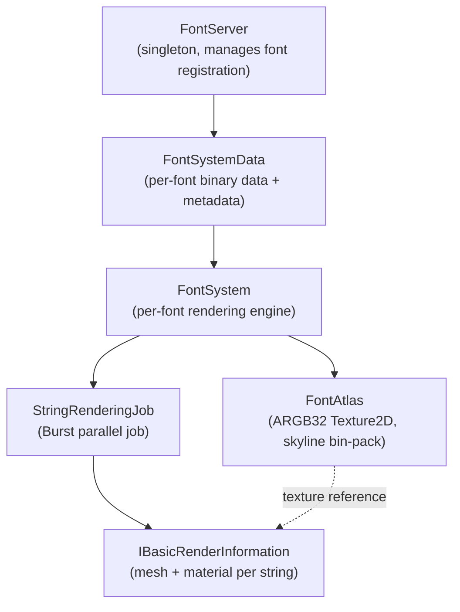
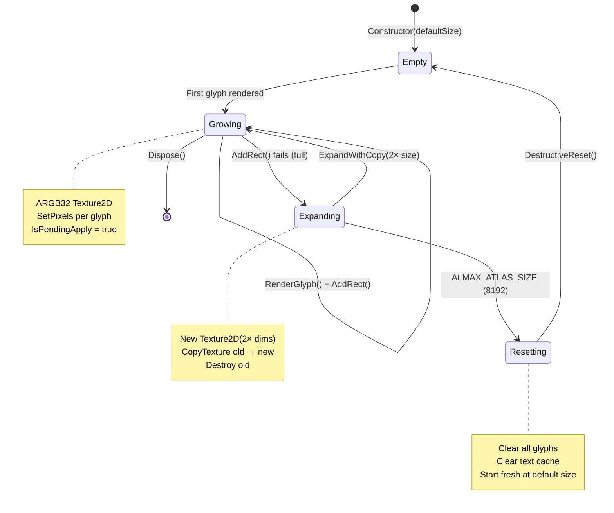
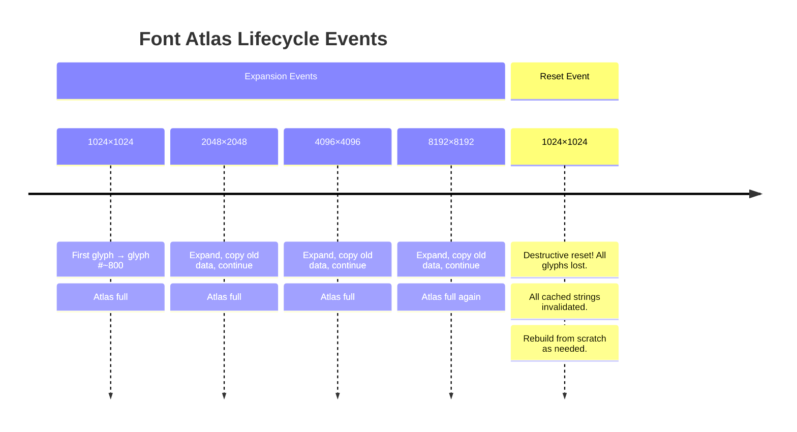
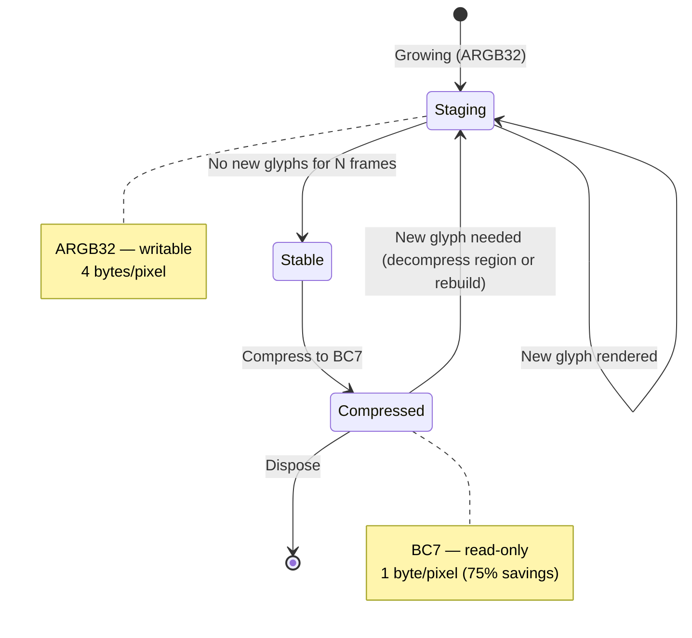
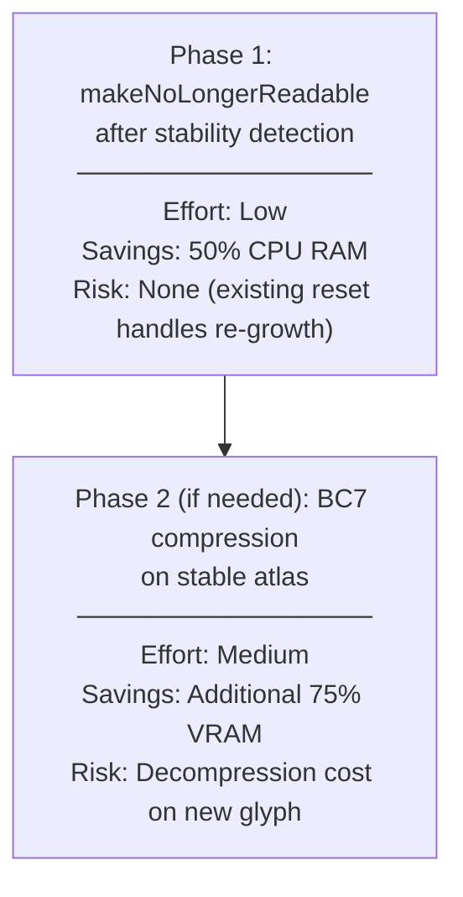
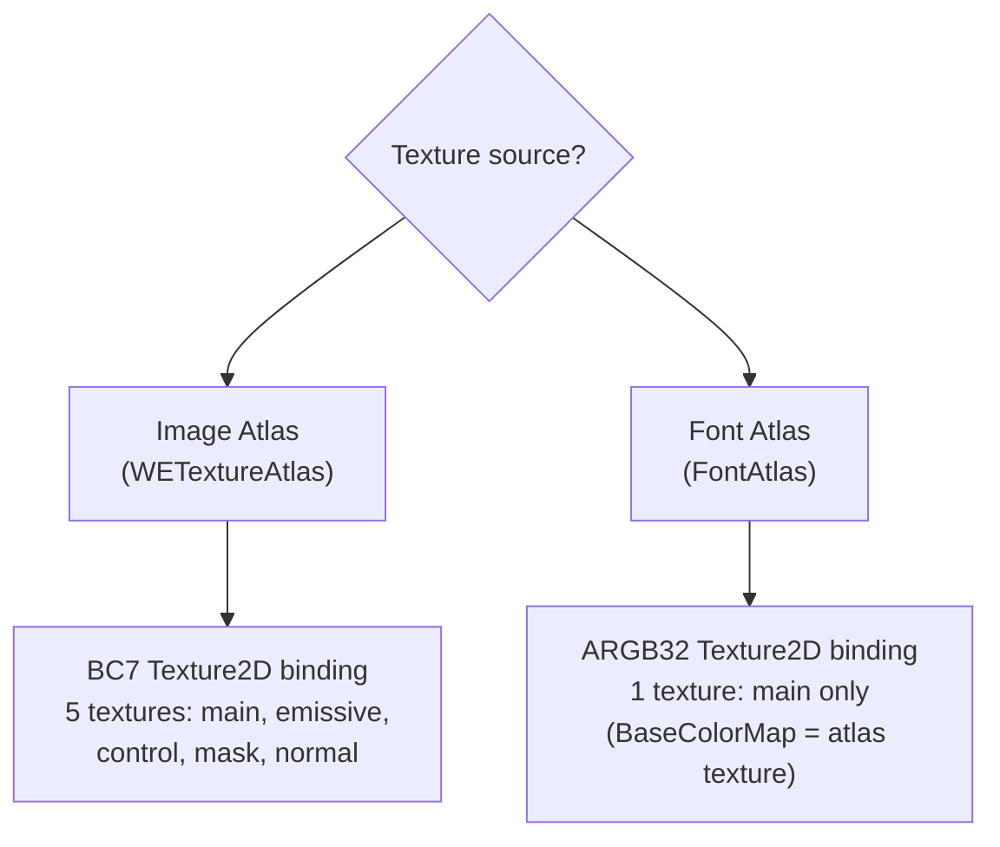

# 04 — Font Atlas Research: VT Compatibility Analysis

> **Purpose**: Analyze the BelzontWE font atlas system to determine VT compatibility, document constraints, and recommend a memory optimization strategy that coexists with image atlas VT registration.

## Current Font Atlas Architecture

### System Hierarchy



### FontAtlas Lifecycle



### Key Properties

| Property | Value | Notes |
|----------|-------|-------|
| Format | `ARGB32` | 4 bytes/pixel, white RGB + alpha glyph shape |
| Initial size | `512 << StartTextureSizeFont` | Default: 1024×1024 (setting = 1) |
| Max size | `8192×8192` | Constant `MAX_ATLAS_SIZE` |
| Growth | 2× each dimension | 1024 → 2048 → 4096 → 8192 |
| Expansions before reset | 3 | 1K→2K→4K→8K, then destructive |
| Packing algorithm | Skyline bottom-left | `AddRect()` with `BestAreaSkyline` heuristic |
| Glyph format | White RGB, alpha = shape | Single-channel effectively |
| Apply timing | Deferred (`IsPendingApply`) | Batched per frame, not per glyph |

### Memory Cost

| Atlas Size | ARGB32 | Estimate/Font |
|-----------|--------|---------------|
| 1024×1024 | 4 MB | Latin script, ~200 glyphs |
| 2048×2048 | 16 MB | CJK partial, ~2000 glyphs |
| 4096×4096 | 64 MB | CJK full, ~5000+ glyphs |
| 8192×8192 | 256 MB | Maximum before reset |

**Typical scenario**: 5-10 fonts × 4-16 MB = **20-160 MB** for fonts alone.

---

## Why VT Is Incompatible With Font Atlas

### Problem 1: Per-Pixel Dynamic Writes

Font glyphs are rendered character-by-character via `SetPixels()`:

```csharp
public void RenderGlyph(FontGlyph glyph) {
    if (_texture == null) CreateTexture();
    _texture.SetPixels(x, y, w, h, glyphPixels);
    IsPendingApply = true;
    Version++;
}
```

VT requires **complete, pre-compressed BC7 tiles** (512×512 blocks). A single glyph is typically 16-64 pixels wide. Writing a glyph would require:
1. Decompress the affected BC7 tile(s) to RGBA
2. Write glyph pixels
3. Re-compress to BC7
4. Upload to VT cache
5. Invalidate the affected VT region

This negates any streaming benefit — you'd be decompressing and recompressing tiles constantly during text layout.

### Problem 2: Dynamic Growth + Destructive Reset



VT registration involves reserving atlas space (`ReserveTextureRect`). Each expansion would require:
- Releasing old VT slot (no public release API observed)
- Reserving new larger slot
- Re-uploading all tile data
- Re-binding all materials that reference this atlas

A destructive reset would need to release the VT slot entirely, with every string's material being invalid until re-rendered.

### Problem 3: Unknown Character Set

Image atlases have a fixed, known set of sprites at load time. Font atlases are **demand-driven** — glyphs are rendered when first needed. For VT, you'd need to know the complete tile data before registering. This is fundamentally incompatible with on-demand glyph rasterization.

### Problem 4: Single-Channel Data

Font glyphs are effectively single-channel (alpha only, RGB = white). VT is designed for multi-layer PBR materials (basecolor + normal + mask). Registering a single alpha-channel texture to VT wastes 3/4 of each BC7 tile's capacity and gains nothing versus a single `Texture2D`.

---

## Recommended Strategy: BC7 Compression Without VT

### Approach: Compress-on-Stability

Font atlases go through periods of intense growth (loading new scenes, new text appearing) followed by stability (all needed glyphs cached). We can compress during stable periods:



**Challenge**: Once compressed to BC7, you cannot `SetPixels()` — must decompress first. Two sub-strategies:

#### Strategy A: Keep ARGB32, Accept the Cost

Keep font atlases as `ARGB32` always. With the expected user scenario (~10 fonts):

| Scenario | Count | Size | Total |
|----------|-------|------|-------|
| Latin-only | 10 fonts | 4 MB each | 40 MB |
| Mixed (some CJK) | 10 fonts | 4-16 MB each | 40-160 MB |
| Heavy CJK | 10 fonts | 16-64 MB each | 160-640 MB |

For Latin-heavy usage, 40 MB is acceptable. CJK usage is the concern.

#### Strategy B: DXT1 Compression (Single-Channel Optimization)

Since font glyphs are single-channel (alpha), `DXT1` (BC1) is optimal:
- 0.5 bytes/pixel (vs 4 for ARGB32) — **87.5% reduction**
- But: DXT1 has no alpha channel → encode alpha into luminance
- Requires shader change: sample luminance as alpha instead of alpha channel

```csharp
// After atlas stabilizes:
var compressed = new Texture2D(width, height, TextureFormat.DXT1, false);
// Remap: ARGB32[a] → DXT1[rgb] (white * alpha → grey)
for (int i = 0; i < pixels.Length; i++)
    pixels[i] = new Color(pixels[i].a, pixels[i].a, pixels[i].a, 1f);
compressed.SetPixels(pixels);
compressed.Compress(true);
compressed.Apply(false, true); // make non-readable
```

| Format | 1024² | 2048² | 4096² |
|--------|-------|-------|-------|
| ARGB32 | 4 MB | 16 MB | 64 MB |
| DXT1 | 0.5 MB | 2 MB | 8 MB |
| BC7 | 1 MB | 4 MB | 16 MB |

**However**: This requires decompressing back to ARGB32 when new glyphs arrive, which is expensive for large atlases.

#### Strategy C: `makeNoLongerReadable` (Simplest Win)

Currently, `Texture2D.Apply()` is called without `makeNoLongerReadable`:
```csharp
_texture.Apply(); // keeps CPU-side copy
```

Changing to:
```csharp
_texture.Apply(false, false); // still readable for now
// After stability detection:
_texture.Apply(false, true); // release CPU copy
```

This eliminates the CPU-side mirror (halves memory) without changing format. If a new glyph arrives, the texture must be re-created — but the destructive reset mechanism already handles this case.

| State | VRAM | CPU RAM | Total |
|-------|------|---------|-------|
| Current (readable) | 4 MB | 4 MB | 8 MB |
| Non-readable | 4 MB | 0 | 4 MB |

**For 10 fonts at 1024²**: 80 MB → 40 MB. Simple, safe, no format changes.

### Recommendation



**Phase 1** is recommended for the initial sprint. **Phase 2** only if CJK-heavy users report memory issues.

---

## Font + Image Atlas Coexistence

### Material Binding Split

With image atlases using BC7 (or VT), and font atlases staying ARGB32, the material creation path must handle both:



**No code change needed for Phase 1** of either atlas optimization:
- Image atlas BC7: `Material.SetTexture()` accepts any `Texture2D` regardless of format
- Font atlas `makeNoLongerReadable`: No material change, just texture lifecycle

Only **VT registration (image atlas Path B)** would require material binding changes.

### Shader Compatibility

Current shaders (`BH/SG_DefaultShader`, `BH/GlsShader`, `BH/Decals/DefaultDecalShader`) support both:
- Direct texture binding via `_BaseColorMap` etc. (current mode)
- VT binding via `_UseStack0`/`_UseStack1` + `ENABLE_VT` keyword

Font materials will always use direct binding. This is already how the game handles materials — some VT, some not. No shader modifications needed.

---

## Font Atlas Serialization Note

Font atlases are **never serialized** to savegames. They are transient:
- Built from font binary data loaded from disk
- Glyphs rendered on-demand as text objects require them
- Entirely rebuilt on game load or destructive reset

This means:
- No savegame format migration needed for fonts
- No BC7 disk cache needed for fonts (the font binary files ARE the cache)
- Font atlas optimization is purely a runtime memory concern

---

## Summary

| Aspect | Image Atlas | Font Atlas |
|--------|-------------|------------|
| VT Compatible? | ✅ Yes (static after build) | ❌ No (dynamic growth + per-pixel writes) |
| BC7 Compression? | ✅ Yes (after Apply) | ⚠️ Possible but complex (stability detection) |
| Disk Cache? | ✅ Yes (.cache.we.bc7) | ❌ Not needed (rebuilt from font data) |
| Serialized? | ✅ Yes (city atlases) | ❌ No (transient) |
| Recommended Optimization | BC7 + disk cache (Phase 1) | `makeNoLongerReadable` (Phase 1) |
| Memory Savings | ~87% | ~50% (CPU RAM only) |
| Expected count | 5-15 atlases | 5-10 fonts |
| Expected total memory | 100-400 MB → **13-52 MB** | 40-160 MB → **20-80 MB** |
