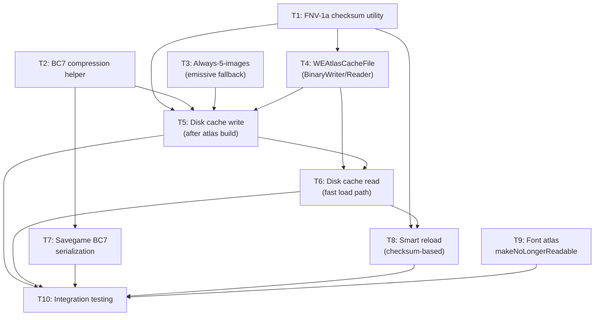

# 05 — Sprint Roadmap: Atlas Memory Optimization

> **Purpose**: Sprint plan for atlas memory optimization. Scoped to image atlas BC7 compression + disk caching (Path A) and font atlas `makeNoLongerReadable`. VT registration (Path B) is deferred to a future sprint.

## Sprint Scope

### In Scope
- BC7 compression for image atlases after `Apply()`
- BC7 disk cache system (`.cache.we.bc7` files with checksum validation)
- Savegame serialization migration (PNG → BC7, with backward compatibility)
- Font atlas `makeNoLongerReadable` after stability detection
- Always-5-images enforcement (emissive fallback to main)
- Smart UI reload (checksum-based skip)

### Out of Scope (Future Sprint)
- VT registration (R9 from action plan)
- VT material binding changes (R10)
- Font atlas BC7 compression (Phase 2 optimization)
- Mipmap generation

---

## Dependency Graph



---

## Task Details

### T1 — FNV-1a Checksum Utility

**User Story**: As the atlas system, I need a fast deterministic checksum of folder contents to detect when cached data is stale.

**Background**: Used by disk cache validation (T5/T6) and smart reload (T8). Must be deterministic across sessions — same files produce same checksum.

**Implementation Notes**:
- New static method in a utility class (e.g., `WEChecksumUtils`)
- Input: folder path → sorted `"{filename}:{filesize}"` strings → FNV-1a hash
- FNV-1a 32-bit: `hash = 2166136261; foreach byte: hash ^= byte; hash *= 16777619;`
- Sort files by name (case-insensitive, ordinal) for determinism

**DoD**:
- [ ] `ComputeFolderChecksum(string folderPath)` returns consistent `uint`
- [ ] Empty folder returns a known sentinel value
- [ ] Files sorted ordinally by name (case-insensitive)
- [ ] Unit test: known folder → known checksum (golden test)
- [ ] Unit test: adding/removing/resizing a file changes checksum

---

### T2 — BC7 Compression Helper

**User Story**: As the atlas system, I need a utility to compress RGBA32 textures to BC7 and extract raw byte data.

**Implementation Notes**:
- Wraps `Texture2D.Compress(highQuality: true)` + `GetRawTextureData()`
- Two variants: sRGB (basecolor, emissive) and UNorm/Linear (normal, mask, control)
- Returns `byte[]` of BC7 data suitable for caching or `LoadRawTextureData`
- Also: `CreateBC7Texture(int w, int h, byte[] data, bool linear)` for deserializing

**DoD**:
- [ ] `CompressToBC7(Texture2D source, bool linear)` returns `byte[]`
- [ ] `CreateFromBC7(int w, int h, byte[] bc7Data, bool linear)` returns `Texture2D`
- [ ] Output Texture2D has `makeNoLongerReadable = true` (no CPU mirror)
- [ ] Round-trip test: RGBA32 → BC7 → Texture2D → visual inspection (lossy but acceptable quality)

---

### T3 — Always-5-Images Enforcement (Emissive Fallback)

**User Story**: As a user, when I add an image without an emissive map, the atlas should use the main image as emissive so the sprite renders correctly with emission effects.

**Implementation Notes**:
- In `WETextureAtlas.Write()` or `Insert()`: if emissive parameter is null, use main texture pixels for emissive layer
- Other missing maps (control, mask) remain `#00000000`
- Normal missing: keep current `(0.5, 0.5, 1.0)` flat-normal fill

**DoD**:
- [ ] Missing emissive → main image copied to emissive region
- [ ] Missing control/mask → transparent black (`#00000000`)
- [ ] Missing normal → flat normal `(0.5, 0.5, 1.0)` (existing behavior)
- [ ] Test: insert sprite with null emissive → emissive region matches main region pixels
- [ ] Test: insert sprite with explicit emissive → explicit emissive used, not main

---

### T4 — WEAtlasCacheFile (Binary Format)

**User Story**: As the atlas system, I need a binary file format to store pre-compressed BC7 atlas data for fast loading.

**Implementation Notes**:
- New class `WEAtlasCacheFile`
- Uses `BinaryWriter`/`BinaryReader` (not game `IWriter` — mod-private file)
- Format:
  ```
  [uint32]   magic ("WBC7")
  [uint32]   formatVersion (1)
  [uint32]   checksum
  [int32]    width, height, size (18-24)
  [byte]     heuristicMethod
  [bytes]    MaxRectsBinPack serialized state
  [int32]    spriteCount
  foreach sprite:
      [string]   name
      [float×4]  region (x, y, w, h)
      [byte]     flags (hasEmissive, hasControl, hasMask, hasNormal)
  foreach of 5 layers:
      [int32]    BC7 data length
      [byte[]]   BC7 raw data
  ```

**DoD**:
- [ ] `WEAtlasCacheFile` can serialize and deserialize all atlas metadata + BC7 data
- [ ] Magic bytes validated on read (reject corrupt/wrong files)
- [ ] Version field supports future format changes
- [ ] Round-trip test: write → read → compare all fields
- [ ] Test: corrupt file (wrong magic) → graceful failure, returns null

---

### T5 — Disk Cache Write (After Atlas Build)

**User Story**: As the atlas system, after building a local atlas from image folders, I write the BC7-compressed result to disk for fast subsequent loads.

**Implementation Notes**:
- After `RegisterAtlas()` completes (all sprites inserted + `Apply()` called):
  1. Compress each of 5 textures to BC7 (T2)
  2. Compute folder checksum (T1)
  3. Write `WEAtlasCacheFile` (T4) to `CACHED_VT_FOLDER/{atlasName}.cache.we.bc7`
- Create `CACHED_VT_FOLDER` directory on first use
- Replaces RGBA32 textures with BC7 Texture2D after writing cache (saves VRAM immediately)
- Also: replace `m_serializationOrder` PNG buffers with BC7 raw bytes

**DoD**:
- [ ] Cache file written after each local atlas build
- [ ] `CACHED_VT_FOLDER` directory created if absent
- [ ] Atlas textures replaced with BC7 after cache write (RGBA32 disposed)
- [ ] `m_serializationOrder` updated with BC7 data (not PNG)
- [ ] Materials still render correctly with BC7 textures
- [ ] Test: build atlas → cache file exists → BC7 data matches atlas content

---

### T6 — Disk Cache Read (Fast Load Path)

**User Story**: As the atlas system, on game load I check for a valid BC7 cache before doing the expensive PNG→RGBA32→BC7 pipeline.

**Implementation Notes**:
- In `LoadImagesFromLocalFoldersCoroutine()`, before building each atlas:
  1. Compute folder checksum (T1)
  2. Try read `WEAtlasCacheFile` from `CACHED_VT_FOLDER/{atlasName}.cache.we.bc7`
  3. If exists AND checksum matches: load BC7 textures directly, skip PNG loading
  4. If missing/mismatch: fall through to existing build path (which now writes cache via T5)
- BC7 textures created via `CreateFromBC7()` (T2) with `makeNoLongerReadable = true`

**DoD**:
- [ ] Valid cache → skips PNG loading, creates atlas from BC7 directly
- [ ] Invalid checksum → deletes stale cache file, falls through to full build
- [ ] Missing cache → falls through to full build (which creates cache)
- [ ] Loaded-from-cache atlas produces identical rendering to freshly-built atlas
- [ ] Test: build, load from cache, compare sprite BRIs (UV coords, materials)
- [ ] Performance: cache load ≤ 50% the time of full build (measured with Stopwatch)

---

### T7 — Savegame BC7 Serialization

**User Story**: As the atlas system, city atlas data saved to savegames should use BC7 instead of PNG for smaller save files.

**Implementation Notes**:
- `WEAtlasesLibrary` serialization version: `0` → `1`
- `WETextureAtlas.Serialize()`: write BC7 raw bytes instead of PNG
- `WETextureAtlas.Deserialize()`: version 0 → decode PNG (backward compat); version 1 → load BC7
- The deferred image load action must create BC7 textures on main thread

**DoD**:
- [ ] New save → version 1 with BC7 data
- [ ] Load version 0 save → decodes PNG, works as before
- [ ] Load version 1 save → loads BC7 directly
- [ ] Save file size reduced ~60-75% for atlas data
- [ ] Test: save with version 0, load, re-save → version 1 migration
- [ ] Test: load version 1, verify rendering identical to version 0

---

### T8 — Smart UI Reload (Checksum-Based)

**User Story**: As a user, when I click "Reload Images" in the UI and nothing changed, the reload should be instant.

**Implementation Notes**:
- New field: `Dictionary<FixedString32Bytes, uint> m_localAtlasChecksums` in `WEAtlasesLibrary`
- Populated during initial load (T5/T6)
- On reload trigger:
  1. Compute fresh checksum per folder (T1)
  2. Compare with stored checksum
  3. Only rebuild atlas if checksum differs
  4. Update stored checksum after rebuild

**DoD**:
- [ ] Unchanged folders → atlas not rebuilt, not disposed
- [ ] Changed folder → only that atlas rebuilt
- [ ] New folder → new atlas created
- [ ] Deleted folder → atlas disposed, removed
- [ ] Test: reload without changes → no atlas Dispose() calls
- [ ] Test: modify one folder → only that folder's atlas rebuilt

---

### T9 — Font Atlas `makeNoLongerReadable`

**User Story**: As the font system, after the font atlas stabilizes (no new glyphs for N frames), I release the CPU-side copy to halve memory usage.

**Implementation Notes**:
- Add a stability counter to `FontAtlas`:
  ```csharp
  private int _framesSinceLastGlyph;
  private bool _isReadable = true;
  private const int STABILITY_THRESHOLD = 300; // ~5 seconds at 60fps
  ```
- Each frame: if `IsPendingApply` was false, increment counter. Reset on any glyph write.
- When counter reaches threshold: `_texture.Apply(false, true)` → non-readable
- When a new glyph is needed and atlas is non-readable:
  - If atlas had room (from packing state): must recreate as readable — **destructive reset**
  - OR: track whether packing has free space; if yes, recreate readable from GPU readback

**Simpler approach**: Only call `makeNoLongerReadable` on expansion/reset boundaries, not after stability. On `ExpandWithCopy()`, the OLD texture is destroyed anyway — the NEW texture can be created readable, then on NEXT expansion the old (now stable) is destroyed. Net effect: only the current active atlas is readable.

Actually, the simplest safe implementation:
- After `Apply()`: do NOT call `makeNoLongerReadable` (need to keep writing)
- On `ExpandWithCopy()`: OLD texture is `Destroy()`'d → memory freed anyway
- On `_texture.Apply()` after stability: `_texture.Apply(false, true)` IF we add a "frozen" state
- On new glyph when frozen: full destructive reset (re-render all cached glyphs)

**DoD**:
- [ ] Stability detection: no new glyphs for N frames → atlas marked non-readable  
- [ ] CPU RAM freed after marking non-readable (~50% reduction)
- [ ] New glyph after freeze → triggers atlas rebuild (not crash)
- [ ] Cached strings still render correctly after freeze
- [ ] Test: render text, wait for stability, verify CPU memory freed
- [ ] Test: render new character after freeze, verify atlas rebuilds and renders

---

### T10 — Integration Testing

**User Story**: As a developer, I need comprehensive tests verifying that all atlas optimizations work together and don't break existing functionality.

**DoD**:
- [ ] Full atlas lifecycle test: build → cache → reload-from-cache → serialize → deserialize
- [ ] Backward compatibility test: load v0 savegame → verify rendering → re-save as v1
- [ ] Smart reload test: initial load → modify one folder → reload → only changed atlas rebuilt
- [ ] Font stability test: render text → freeze → render new text → verify rebuild
- [ ] Memory measurement: before/after comparison for typical scenario (5 atlases + 5 fonts)
- [ ] No existing test regressions

---

## Sprint Ordering

```mermaid
gantt
    title Atlas Memory Optimization Sprint
    dateFormat  X
    axisFormat  Task %s
    
    section Foundation
    T1 FNV-1a Checksum         :t1, 0, 1
    T2 BC7 Compression Helper  :t2, 0, 1
    T3 Always-5-Images         :t3, 0, 1
    
    section Cache System
    T4 Cache File Format       :t4, after t1, 1
    T5 Disk Cache Write        :t5, after t2 t3 t4, 2
    T6 Disk Cache Read         :t6, after t5, 1
    
    section Serialization
    T7 Savegame BC7            :t7, after t2, 2
    
    section UI & Font
    T8 Smart Reload            :t8, after t1 t6, 1
    T9 Font makeNoLongerReadable :t9, 0, 2
    
    section Validation
    T10 Integration Testing    :t10, after t5 t6 t7 t8 t9, 2
```



### Parallel tracks:
- **Track A** (image atlas): T1 + T2 + T3 → T4 → T5 → T6 → T8
- **Track B** (serialization): T2 → T7
- **Track C** (font): T9 (independent)
- **Track D** (integration): T10 (after all others)

### Estimated task count: 10 tasks

---

## Expected Outcomes

### Memory Reduction (10 local atlases at 1024², 5 fonts at 1024²)

| Component | Before | After | Reduction |
|-----------|--------|-------|-----------|
| Image atlas VRAM (10 × 20 MB) | 200 MB | 50 MB | **75%** |
| Image atlas CPU (readable + PNG) | 200 MB | 0 | **100%** |
| Font atlas CPU (readable mirror) | 20 MB | 0* | **100%*** |
| **Total** | **420 MB** | **50 MB** | **88%** |

> \*After stability detection releases CPU copy. VRAM unchanged for fonts (no format change in Phase 1).

### Load Time

| Scenario | Before | After |
|----------|--------|-------|
| First load (no cache) | Baseline | +5-10% (compression overhead) |
| Subsequent load (cached) | Same as first | **50-80% faster** (skip PNG decode) |
| Reload (no changes) | Same as first | **~Instant** (checksum skip) |

### Save File Size

For 2 city atlases at 1024², 5 layers:
- Before: ~20-40 MB (PNG)
- After: ~10 MB (BC7 raw)
- **~60% reduction**
