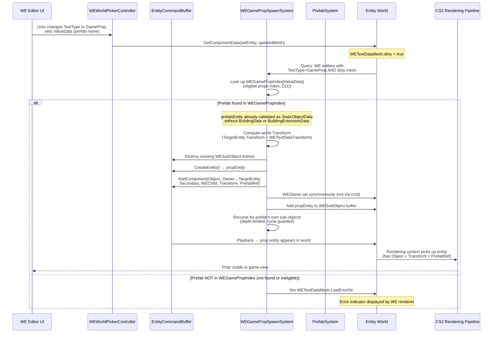
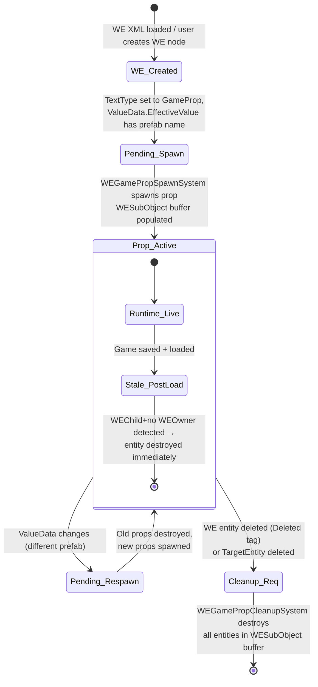
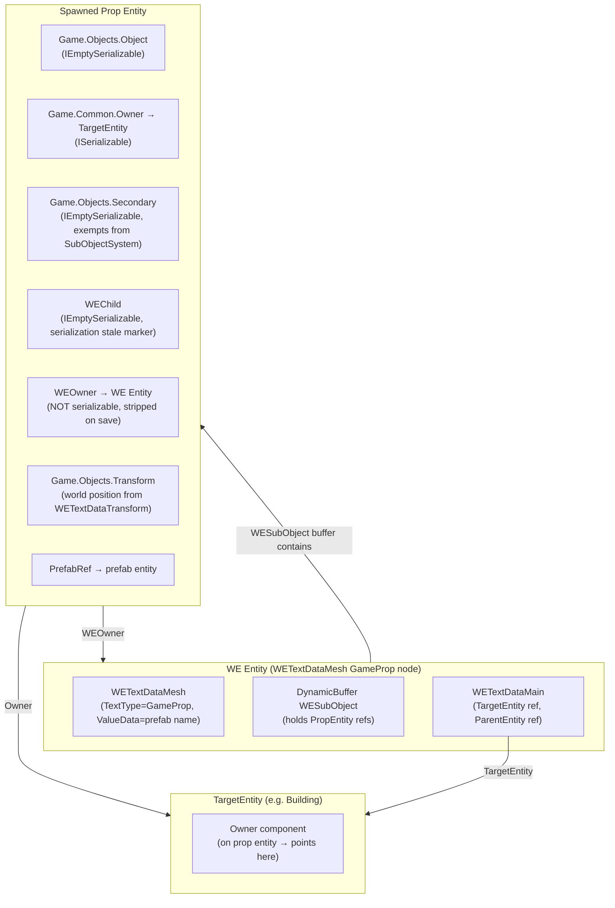

# Game Prop Feature — Dependencies, Request Path & Circular Reference Guards

**Date:** 2026-04-21  
**Related:** `01_GamePropFeatureRequirementsAndCriticalPoints.md`

---

## 1. Prefab Search Strategy

### 1.1 Where Prefabs Are Searched

All placeable game props exist as prefab entities in the `PrefabSystem`. The lookup uses the prefab's **name string** stored in `WETextDataMesh.ValueData.DefaultValue` (backed by `WEStringsBank` int index). `ValueData.EffectiveValue` (FixedString512Bytes) is computed from this.

#### Existing Prefab Index Infrastructure

The mod already maintains two relevant data structures in `WETemplateManager.PrefabLayout.cs`:

- **`PrefabNameToIndex`** — `Dictionary<string, HashSet<long>>` mapping prefab name → set of `PrefabData.m_Index` (long) values. Populated during game load from `PrefabSystem`. This is what `WEPrefabTemplateFilterJob` uses via `NativeHashMap<long, Hash128> m_indexesWithLayout`.
- **`WEStringsBank.Instance`** — string interning table. `WETextDataValueString` stores strings as `int` indices into this bank, enabling O(1) key lookup without per-frame string allocation.

#### Performance-Optimal Lookup Path

Instead of calling `PrefabSystem.TryGetPrefab<>()` (reflection-heavy), the spawn system should:

1. Read `ValueData.DefaultValue` → get string from `WEStringsBank`
2. Look up `WETemplateManager.PrefabNameToIndex[name]` → get `HashSet<long>` of `m_Index` values
3. From the first valid index, look up the prefab entity via `EntityManager` component lookup (`ComponentLookup<PrefabData>`) or `PrefabSystem.TryGetEntity()`
4. Validate: entity must have `ObjectData` component (ensures it's a spawnable prop, not a building network, etc.)

```csharp
// Performance-optimal resolution using existing PrefabNameToIndex
var prefabName = meshData.ValueData.DefaultValue; // comes from WEStringsBank
if (m_templateManager.PrefabNameToIndex.TryGetValue(prefabName, out var indexSet))
{
    foreach (var idx in indexSet)
    {
        // EntityManager lookup by PrefabData.m_Index is already indexed
        if (m_prefabDataLkp.TryGetComponent(m_prefabEntityByIndex[idx], out var prefabData)
            && EntityManager.HasComponent<ObjectData>(m_prefabEntityByIndex[idx]))
        {
            prefabEntity = m_prefabEntityByIndex[idx];
            break;
        }
    }
}
```

**Note:** `PrefabNameToIndex` values are `HashSet<long>` because one prefab name may map to multiple `PrefabData.m_Index` values (the main prefab + `PlaceholderObjectElement` variants). The spawn system picks the first one with `ObjectData`.

**Supported prefab types** (must pass eligibility filter below):
- Static props (`StaticObjectPrefab` directly subclassed without building markers) — the main target
- Animated props (`ActivityPropPrefab extends StaticObjectPrefab`) — included
- Plants / trees — included if they derive from `StaticObjectPrefab`

**Excluded prefab types:**
- `BuildingPrefab` (has `BuildingData` component on prefab entity) — complex lifecycle
- `BuildingExtensionPrefab` (has `BuildingExtensionData`) — building-only
- `MovingObjectPrefab` (has `MovingObjectData`, no `StaticObjectData`) — needs AI

### 1.3 Prefab Eligibility Filter

**Inheritance hierarchy (relevant subset):**
```
PrefabBase
  └── ObjectPrefab
        └── ObjectGeometryPrefab  (abstract) → adds ObjectGeometryData
              ├── StaticObjectPrefab           → adds StaticObjectData
              │     ├── ActivityPropPrefab     → adds ActivityPropData    ✅ eligible
              │     ├── BuildingPrefab         → adds BuildingData        ❌ excluded
              │     └── BuildingExtensionPrefab → adds BuildingExtensionData ❌ excluded
              └── MovingObjectPrefab           → adds MovingObjectData   ❌ excluded
```

**ECS-level eligibility check (on prefab entity):**
```csharp
bool IsEligibleProp(Entity prefabEntity)
    => EntityManager.HasComponent<StaticObjectData>(prefabEntity)
    && !EntityManager.HasComponent<BuildingData>(prefabEntity)
    && !EntityManager.HasComponent<BuildingExtensionData>(prefabEntity);
```

### 1.4 WEGamePropIndex — Performance-Specialised Prefab Index

`WEGamePropIndex` is a `Dictionary<string, Entity>` mapping prefab name → prefab entity for **eligible props only**. It is populated **in the same coroutine as `PrefabNameToIndex`** (`UpdatePrefabIndexDictionary_Coroutine`) — a single pass over `LoadedPrefabBaseList`, no extra processing step:

```csharp
// Inside UpdatePrefabIndexDictionary_Coroutine — single pass, same loop:
WEGamePropIndex.Clear();
foreach (var prefab in prefabs)
{
    var prefabEntity = entities[prefab];
    var data = EntityManager.GetComponentData<PrefabData>(prefabEntity);

    // Existing: populate PrefabNameToIndex
    if (!PrefabNameToIndex.ContainsKey(prefab.name)) PrefabNameToIndex[prefab.name] = new();
    PrefabNameToIndex[prefab.name].Add(data.m_Index);

    // New: populate WEGamePropIndex (eligible props only, first match wins)
    if (!WEGamePropIndex.ContainsKey(prefab.name) && IsEligibleProp(prefabEntity))
        WEGamePropIndex[prefab.name] = prefabEntity;
}
```

The spawn system reads `WEGamePropIndex[prefabName]` directly — O(1), no fallback to `PrefabSystem`.

### 1.2 Prefab Name Format

The prefab name must match exactly the name in `PrefabSystem`. Common formats:
- `"EU_BenchSmall01"` — standard game prop
- `"EU_FlowerBed01"` — plant
- `"ModderPropPack.MyProp"` — modded prop (namespace.name format)

---

## 2. Full Request Path — UI to Rendering



---

## 3. Entity Lifecycle State Machine



---

## 4. Circular Dependency Problem

### 4.1 The Loop Scenario

A WE layout can be attached to any game entity, **including entities spawned as GameProps**. This creates a potential infinite spawn chain:

```
Building (TargetEntity)
  └── WE Node A [GameProp → "EU_BenchSmall01"]
        └── spawns → BenchEntity (has WEChild, Owner→Building)
              └── (another mod / user) WE Node B on BenchEntity
                    └── WE Node B [GameProp → "EU_BenchSmall01"]
                          └── spawns → BenchEntity2 ...
                                └── ∞
```

Additionally, a user could directly configure a GameProp that points to:
- Its own prefab (direct self-reference)
- A prefab that has a WE layout containing a GameProp that points back to the original

### 4.2 Detection Strategy

Two orthogonal guards are required:

#### Guard A — Depth Limit
Track the spawn depth through the `WESubObject` recursion. WE uses **depth limit 4** (conservative; vanilla uses `kMaxSubObjectDepth = 7` but WE props can themselves host WE layouts, so a shallower cap prevents runaway chains). A `WESubObject` spawned at depth > 4 is not created; an error is logged.

**How depth is passed:** The spawn system maintains a depth counter per spawned entity. Since the spawn system is managed (main-thread), a simple `NativeHashMap<Entity, int>` keyed by WE entity can track current depth.

#### Guard B — Prefab Cycle Detection
Track the chain of prefab names in the current spawn path. If the same prefab name appears twice in the chain, the spawn is aborted.

**Implementation:** A `NativeParallelHashSet<FixedString512Bytes>` or `HashSet<string>` of prefab names currently being processed in the recursive call stack. This is per-frame, not persistent.

### 4.3 Guard Decision Matrix

| Scenario | Guard A (depth) | Guard B (cycle) | Outcome |
|----------|-----------------|-----------------|---------|
| A → B → C → D → E (depth 5) | ❌ blocked | — | Stops at depth 4 |
| A → B → A (direct cycle) | — | ❌ blocked | A appears twice in chain |
| A → B → C → A (indirect cycle) | — | ❌ blocked | A appears twice in chain |
| A → B → C (valid, depth 3) | ✅ allowed | ✅ allowed | Spawns normally |

---

## 5. Guard Implementation Sketch

```csharp
private const int kMaxWESubObjectDepth = 4; // conservative; vanilla uses 7

private void SpawnPropRecursive(
    Entity weEntity, Entity targetEntity, 
    string prefabName,
    HashSet<string> visitedPrefabNames, 
    int depth)
{
    if (depth > kMaxWESubObjectDepth)
    {
        LogError(weEntity, $"WESubObject depth limit exceeded (max {kMaxWESubObjectDepth}).");
        return;
    }
    if (visitedPrefabNames.Contains(prefabName))
    {
        LogError(weEntity, $"Circular WESubObject reference detected: '{prefabName}'.");
        return;
    }
    
    visitedPrefabNames.Add(prefabName);
    // ... spawn prop, recurse into prefab's own sub-objects ...
    visitedPrefabNames.Remove(prefabName); // clean up after recursion
}
```

---

## 6. Component Ownership Summary Diagram



---

## 7. Systems Overview

| System / Component | Phase | Responsibility |
|--------|-------|----------------|
| `WETemplateManager.PrefabLayout.cs` (existing, modified) | OnCreate / `MarkPrefabsDirty()` | **Existing** `UpdatePrefabIndexDictionary_Coroutine` extended to also populate `WEGamePropIndex` (`Dictionary<string,Entity>`) in the same single pass — no separate system needed. |
| `WEGamePropSpawnSystem` | ModificationEnd (managed, rate-limited) | Detects dirty GameProp WE entities (up to N per frame); resolves prefab via `WEGamePropIndex`; spawns prop entities with depth≤4 and cycle guards; populates `WESubObject` buffer. Supports all PrefabSystem prefabs (base + modded). |
| `WEGamePropCleanupSystem` | ModificationEnd | Detects WE entities with `WESubObject` cleanup buffer that are removed → destroys all prop entities in buffer. Also destroys entities with `WEChild` but without `WEOwner` (stale post-load cleanup). |
| `WEGamePropTransformSystem` | PreRendering (burst job) | Keeps prop entity `Transform` in sync with `WETextDataTransform` when `TargetEntity` moves. |

---

## 8. Decisions Log

| # | Decision | Rationale |
|---|----------|-----------|
| 1 | **Depth limit = 4** | Conservative vs. vanilla 7. WE props can host their own WE layouts creating extra recursion depth. |
| 2 | **Cycle detection: per prefab-name** | Simpler than per-entity chain; edge case of two WE nodes legitimately using the same prefab in one chain is an acceptable restriction. |
| 3 | **Transform sync: continuous (every frame)** | Simplest implementation; revisit if perf is a concern. |
| 4 | **Modded prefabs: yes** | All prefabs registered in `PrefabSystem` (base + mods) are supported. `PrefabNameToIndex` already covers this since it is populated from `PrefabSystemOverrides.LoadedPrefabBaseList()`. |
| 5 | **Prefab lookup: via `WEGamePropIndex`** | Dedicated `Dictionary<string,Entity>` built from `PrefabNameToIndex` filtered to eligible props only. O(1) lookup; avoids `PrefabSystem.TryGetPrefab<>()` overhead. `WEStringsBank` provides int key for repeat identity checks. |
| 6 | **Eligible props: `StaticObjectData` ∧ ¬BuildingData ∧ ¬BuildingExtensionData`** | `StaticObjectPrefab` is the correct base for placeable props. `BuildingPrefab` and `BuildingExtensionPrefab` (both extend `StaticObjectPrefab`) are excluded via `BuildingData`/`BuildingExtensionData` markers. `MovingObjectPrefab` is naturally excluded (no `StaticObjectData`). |
| 7 | **Spawn rate-limited** | Max N dirty nodes per system update (like `WEPrefabTemplateDirtyJob` pattern) to avoid frame spikes when many WE GameProp nodes become dirty simultaneously. |
| 8 | **UI in scope** | Prefab name input field for GameProp type included in first sprint. |
